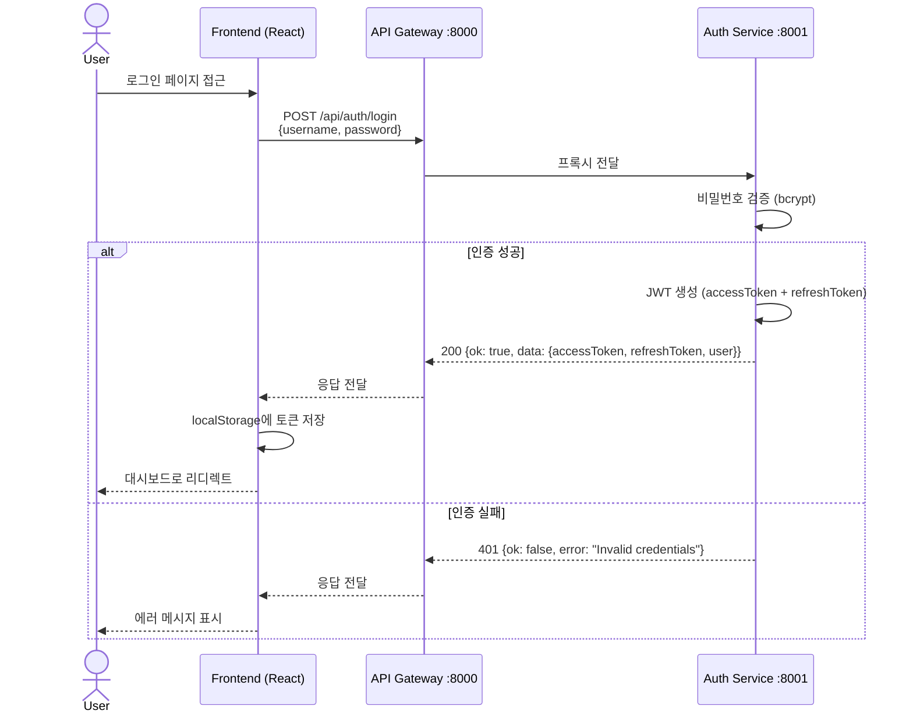
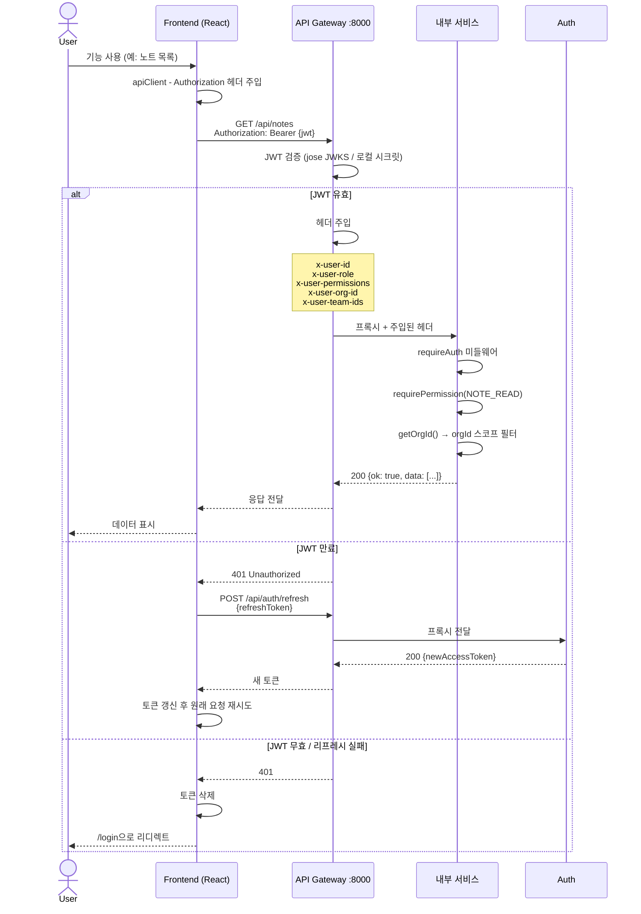
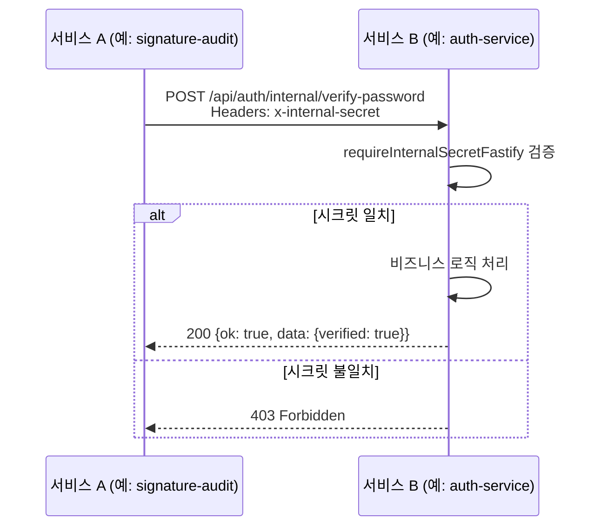

# 인증/인가 흐름 시퀀스 다이어그램

## 1. 로그인 흐름

## 2. API 요청 인가 흐름

## 3. 서비스 간 내부 인증

## 핵심 포인트

| 항목 | 설명 |
|------|------|
| **JWT 검증 위치** | API Gateway에서 1회만 검증, 내부 서비스는 주입된 헤더 신뢰 |
| **토큰 갱신 조건** | accessToken 만료 5분 전 또는 401 수신 시 |
| **동시 갱신 방지** | apiClient에서 단일 Promise로 중복 리프레시 차단 |
| **서비스 간 인증** | `x-internal-secret` 환경변수 일치 확인 |
| **멀티테넌시** | 모든 쿼리에 `orgId` 자동 필터 (누락 = 보안 위반) |
