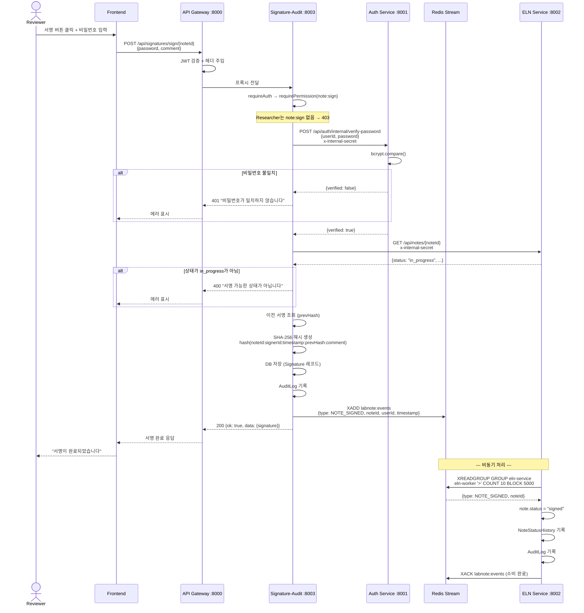
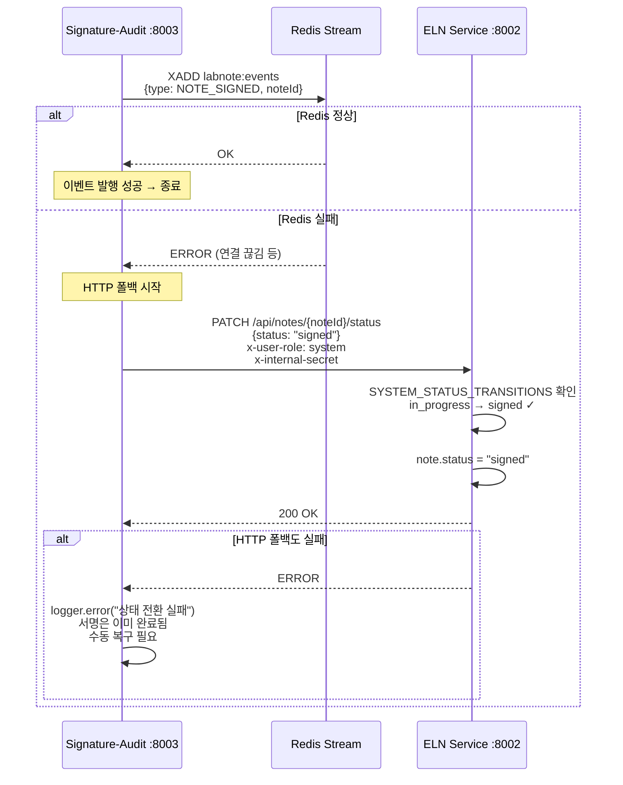
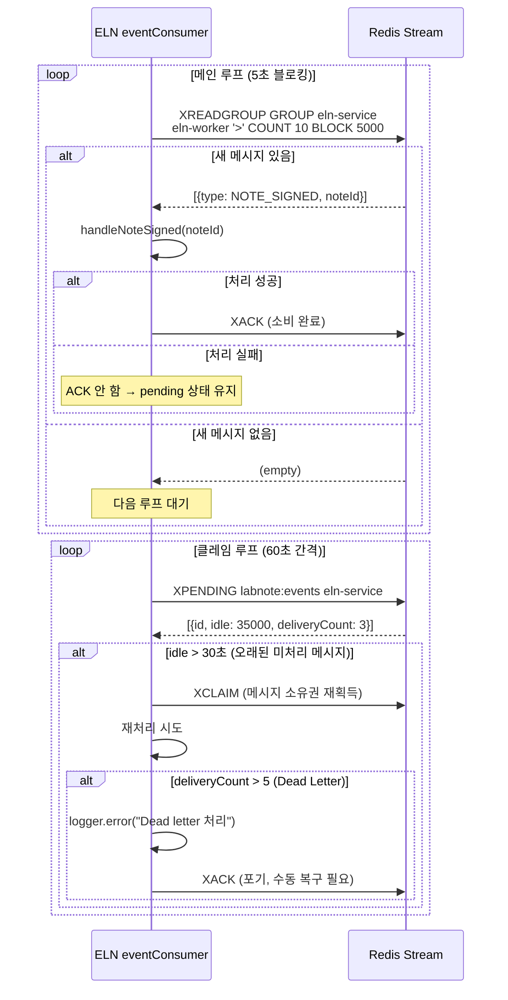

# 노트 서명 흐름 시퀀스 다이어그램

> 이 시스템의 **가장 핵심적인 크로스서비스 흐름**. Redis Stream + HTTP 폴백 이중 경로.

## 1. 전자서명 전체 흐름

## 2. Redis 실패 시 HTTP 폴백

## 3. Redis Stream 소비자 복구 메커니즘

## 핵심 포인트

| 항목 | 설명 |
|------|------|
| **서명 권한** | Reviewer, Admin만 가능 (`note:sign` 퍼미션) |
| **Researcher 차단** | `note:sign` 권한 없음 → 403 |
| **비밀번호 이중 검증** | 로그인 JWT + 서명 시 비밀번호 재확인 |
| **해시체인** | `SHA-256(noteId:signerId:timestamp:prevHash:comment)` |
| **이벤트 전달** | Redis Stream → 실패 시 HTTP 폴백 |
| **상태 전환** | `system` 역할만 가능 (SYSTEM_STATUS_TRANSITIONS) |
| **PATCH /status 직접 signed 불가** | 일반 사용자는 ALLOWED_STATUS_TRANSITIONS에 signed 없음 |
| **Dead Letter** | 5회 초과 재전달 → ACK 처리 + 수동 복구 알림 |
| **signed는 불변** | 어떤 역할도 signed → 다른 상태 전환 불가 |
