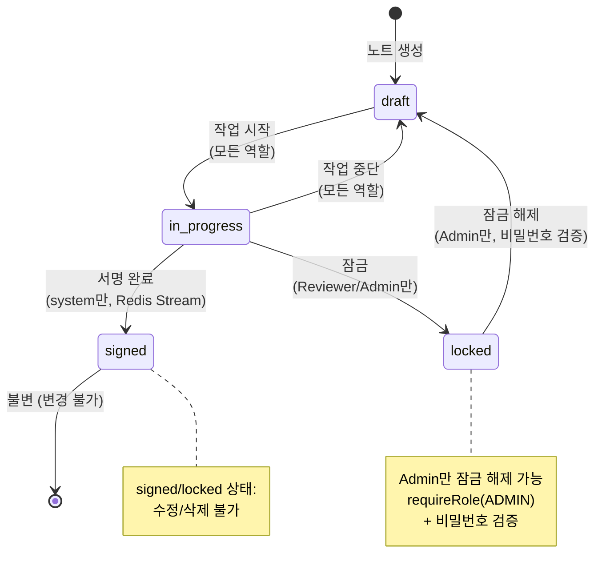
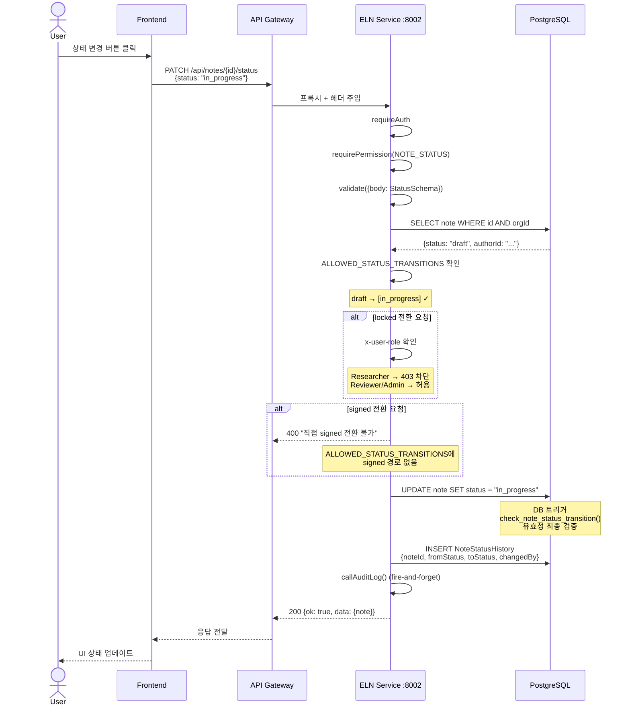
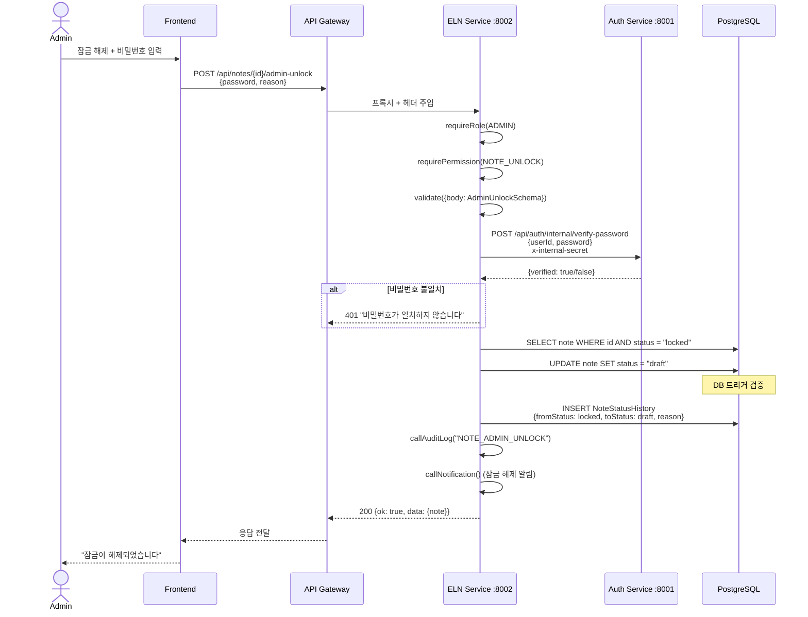
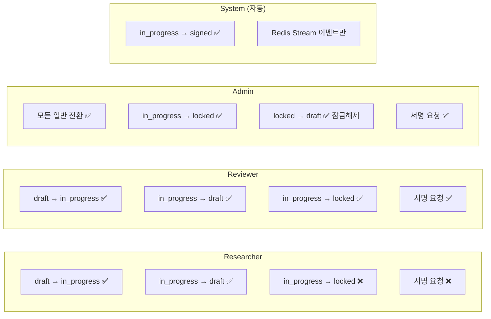
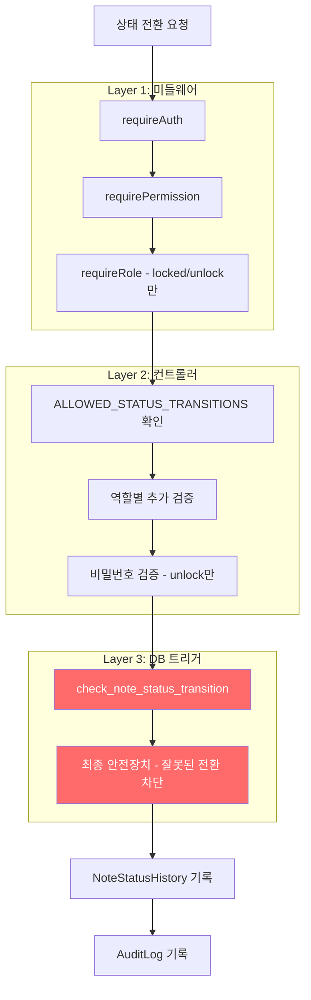

# 노트 상태 전환 시퀀스 다이어그램

## 1. 상태 머신 전체 흐름

## 2. 일반 상태 전환 (PATCH /api/notes/:id/status)

## 3. Admin 잠금 해제 (POST /api/notes/:id/admin-unlock)

## 4. 역할별 전환 권한 매트릭스

## 5. 보호 레이어 다이어그램

## 핵심 제약 요약

| 제약 | 검증 위치 | 실패 시 |
|------|----------|---------|
| signed/locked 노트 수정 불가 | 컨트롤러 (UPDATE/DELETE 전) | 400 에러 |
| signed 직접 전환 불가 | ALLOWED_STATUS_TRANSITIONS | 400 에러 |
| locked 전환은 Reviewer/Admin만 | 컨트롤러 x-user-role 검증 | 403 에러 |
| unlock은 Admin만 | requireRole(ADMIN) | 403 에러 |
| 잘못된 전환 경로 | DB 트리거 | DB 에러 (최종 안전장치) |
| 모든 전환 기록 | NoteStatusHistory + AuditLog | 이중 기록 |
