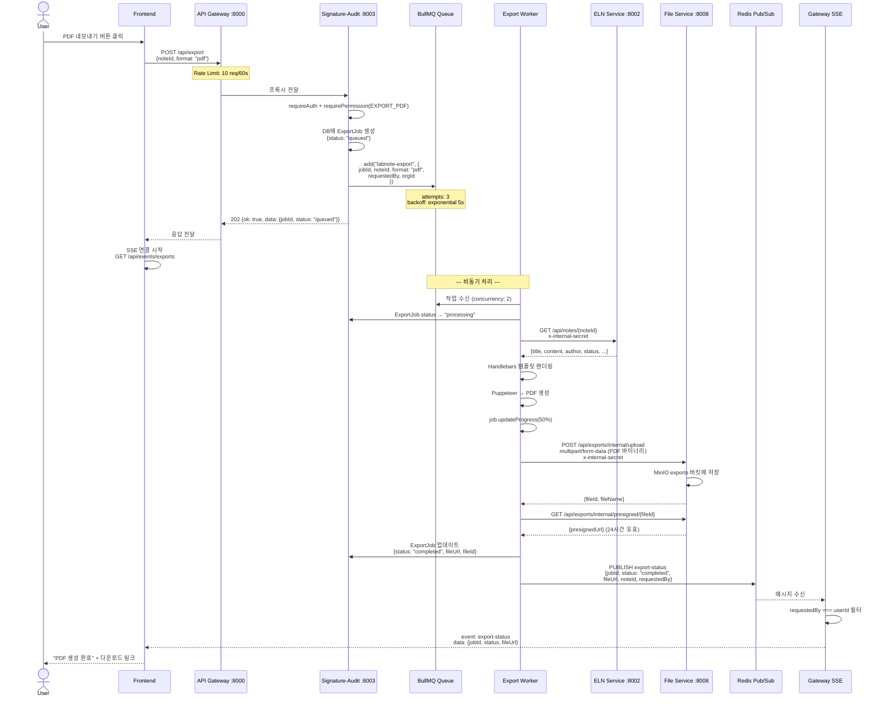
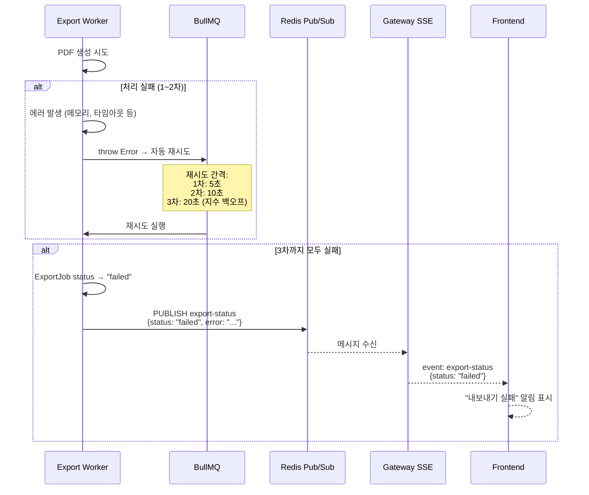
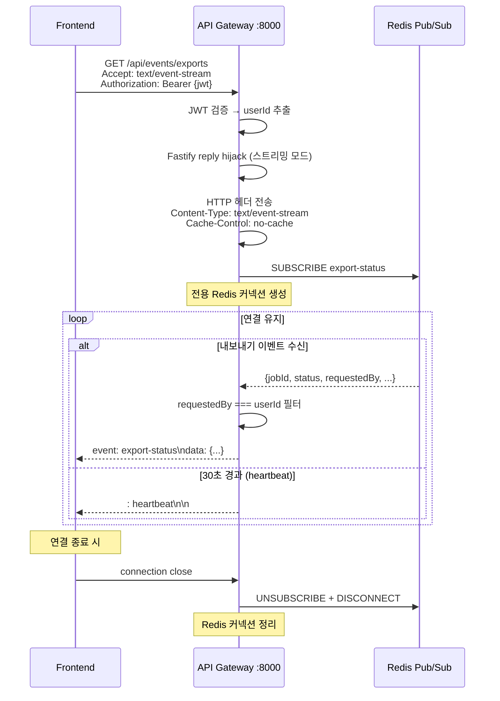
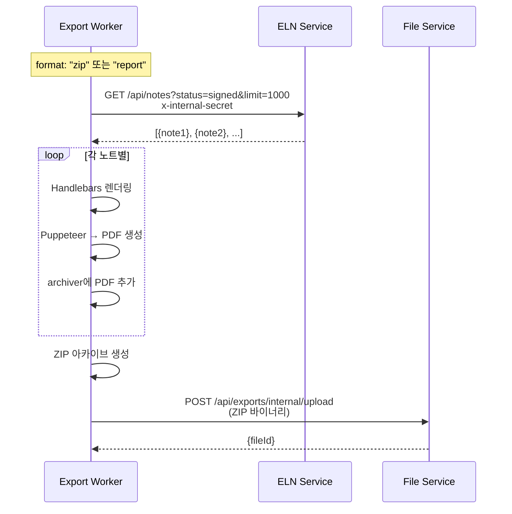

# 파일 내보내기(Export) 흐름 시퀀스 다이어그램

> BullMQ → Puppeteer → MinIO → SSE 4단계 파이프라인

## 1. 내보내기 요청 → 완료 전체 흐름

## 2. 내보내기 실패 & 재시도

## 3. SSE (Server-Sent Events) 연결 상세

## 4. ZIP/리포트 내보내기 (다중 노트)

## 핵심 포인트

| 항목 | 설명 |
|------|------|
| **비동기 처리** | 요청 즉시 202 반환, BullMQ Worker가 백그라운드 처리 |
| **Rate Limit** | `/api/export` — 10 req/60s (Redis 슬라이딩 윈도우) |
| **재시도** | 3회, 지수 백오프 (5s → 10s → 20s) |
| **Worker 동시성** | 2개 (Puppeteer 메모리 고려) |
| **파일 보관** | exports 버킷, presigned URL 24시간 유효 |
| **실시간 알림** | Redis Pub/Sub → SSE (per-user 필터링) |
| **작업 정리** | 완료: 최대 100개 보관, 실패: 최대 50개 보관 |
