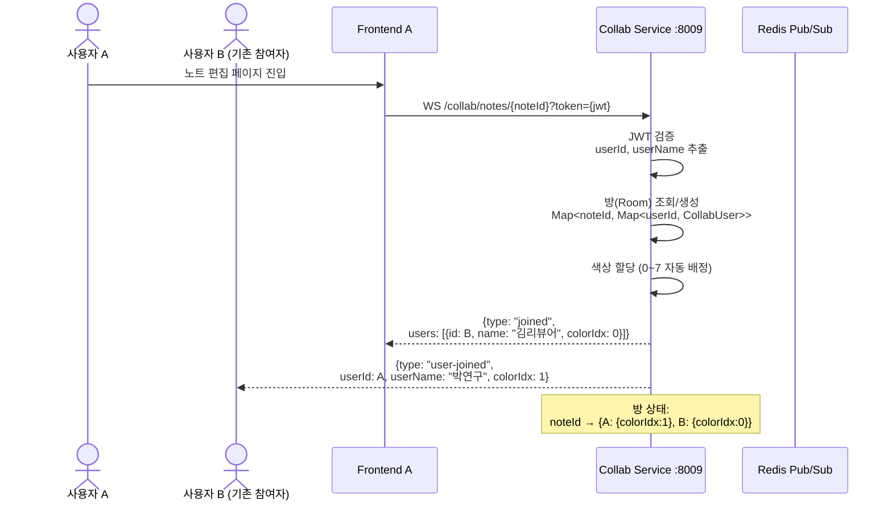
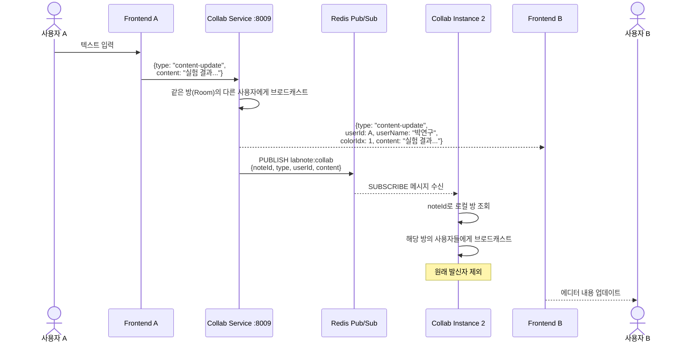
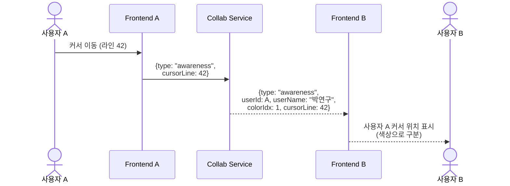
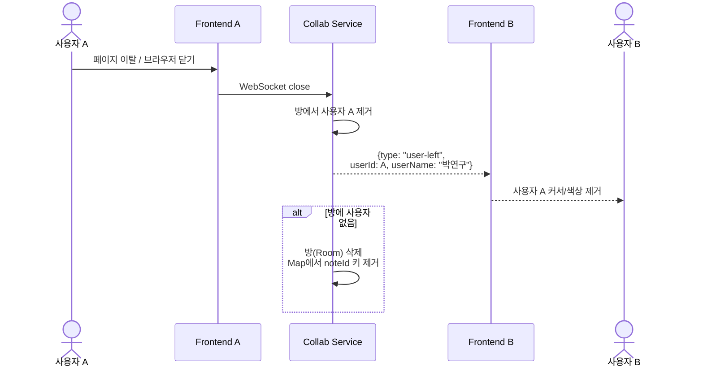
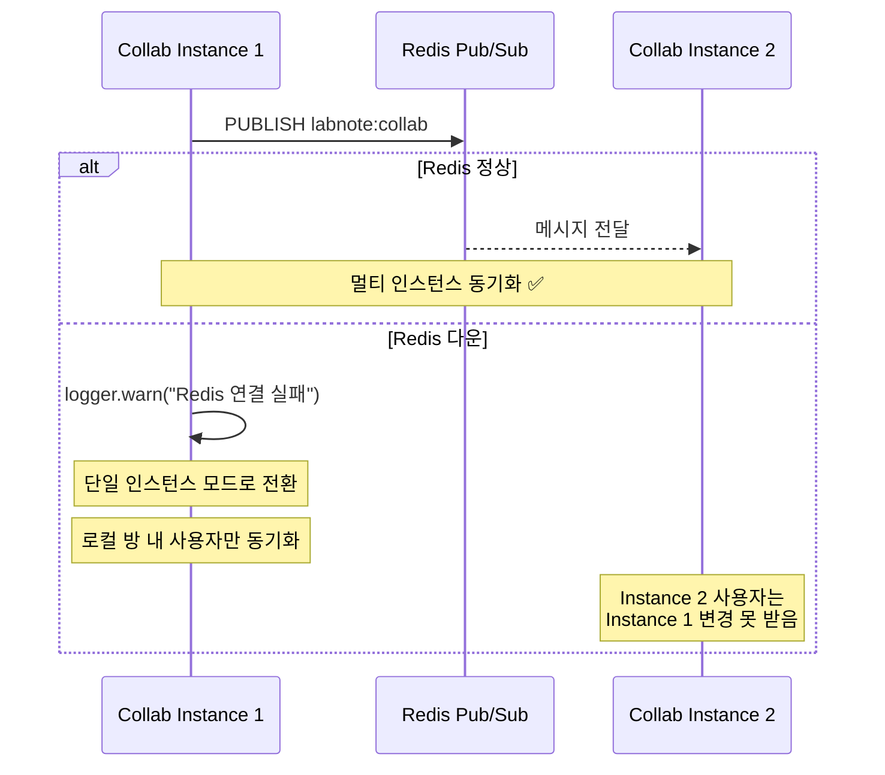
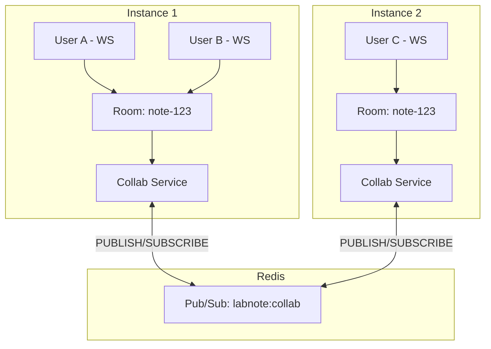

# 실시간 협업 편집 시퀀스 다이어그램

## 1. WebSocket 연결 및 방 입장

## 2. 콘텐츠 편집 동기화

## 3. 커서 위치 공유 (Awareness)

## 4. 연결 해제 및 정리

## 5. Redis 장애 시 Graceful Degradation

## 6. 전체 아키텍처 (멀티 인스턴스)

## 핵심 포인트

| 항목 | 설명 |
|------|------|
| **프로토콜** | Raw WebSocket (ws 라이브러리), Fastify 아님 |
| **인증** | 쿼리 파라미터 `?token={jwt}` → 인메모리 검증 |
| **방 관리** | 인메모리 Map (서버 재시작 시 초기화) |
| **색상** | 0~7 자동 배정 (최대 8명 동시 편집 구분) |
| **멀티 인스턴스** | Redis Pub/Sub (장애 시 단일 인스턴스 폴백) |
| **영속성 없음** | 편집 내용은 별도 API로 저장 (WS는 실시간 동기화만) |
| **포트** | :8009 (API Gateway 프록시 아님, 직접 연결) |
