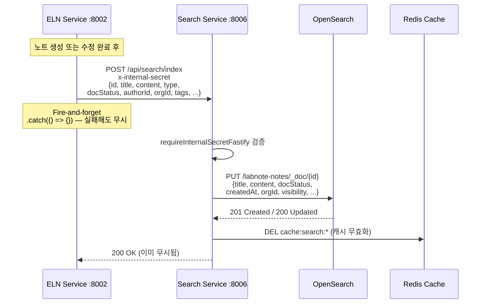
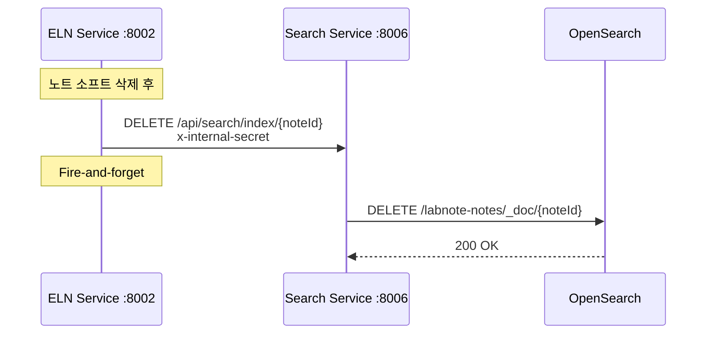
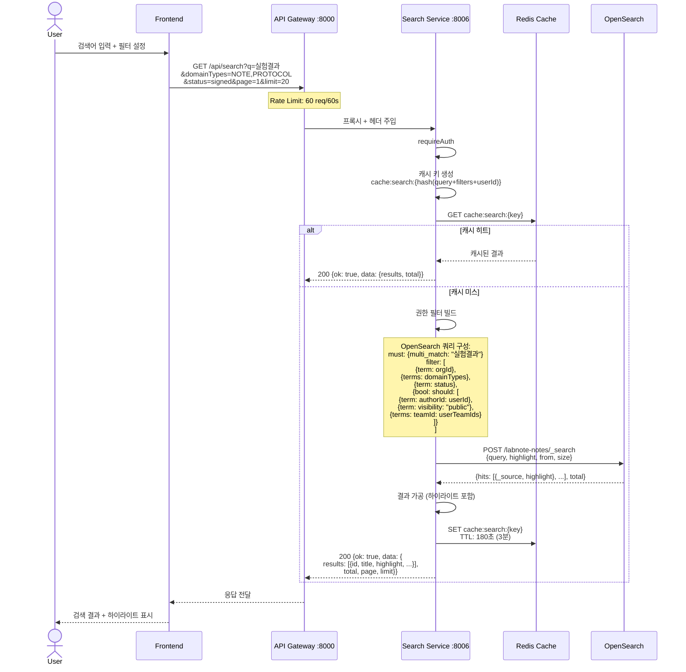
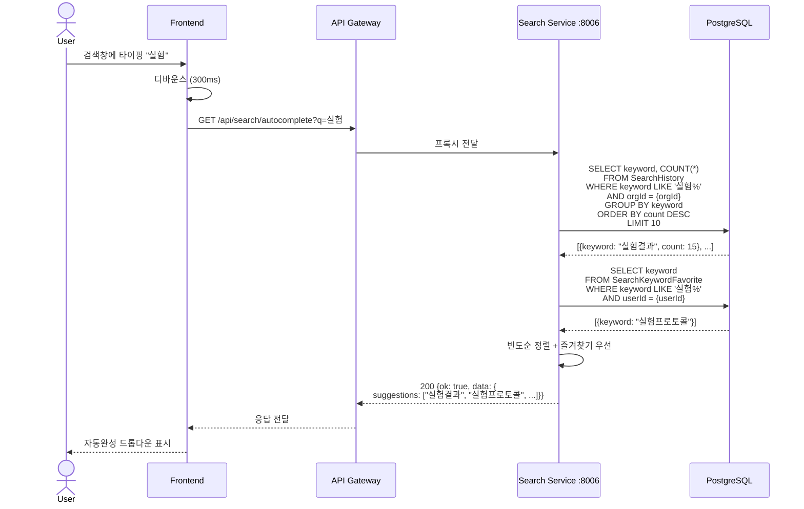
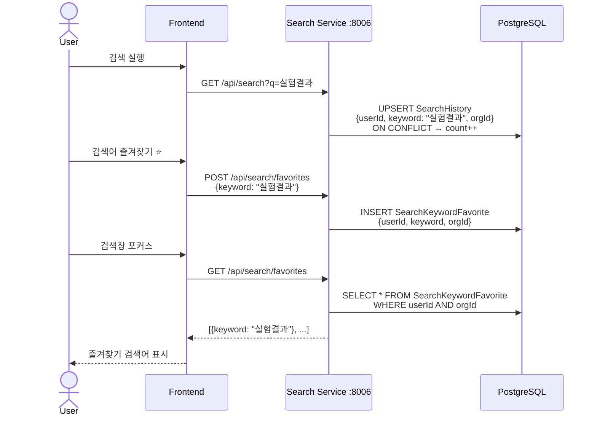

# 검색 인덱싱 & 조회 시퀀스 다이어그램

## 1. 검색 인덱싱 (노트 생성/수정 시)

## 2. 검색 인덱스 삭제 (노트 삭제 시)

## 3. 사용자 검색 요청

## 4. 자동완성 (Autocomplete)

## 5. 검색 히스토리 & 즐겨찾기

## 핵심 포인트

| 항목 | 설명 |
|------|------|
| **인덱싱 방식** | Fire-and-forget (실패해도 메인 작업 영향 없음) |
| **검색 엔진** | OpenSearch 2 (Korean 형태소 분석기) |
| **캐시** | Redis, 3분 TTL, 인덱싱 시 무효화 |
| **권한 필터** | orgId + (authorId OR public OR teamId) |
| **하이라이트** | OpenSearch highlight 기능 활용 |
| **자동완성** | SearchHistory 빈도 기반 + 즐겨찾기 우선 |
| **Rate Limit** | 60 req/60s (검색 엔드포인트) |
