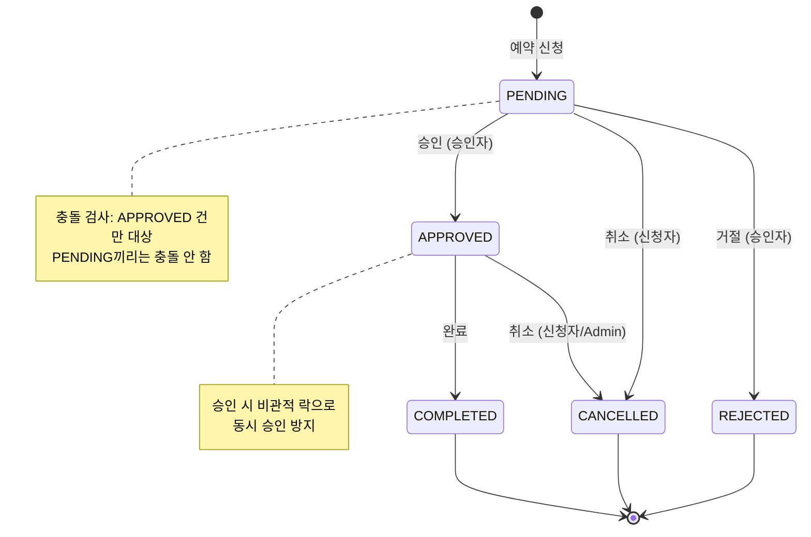
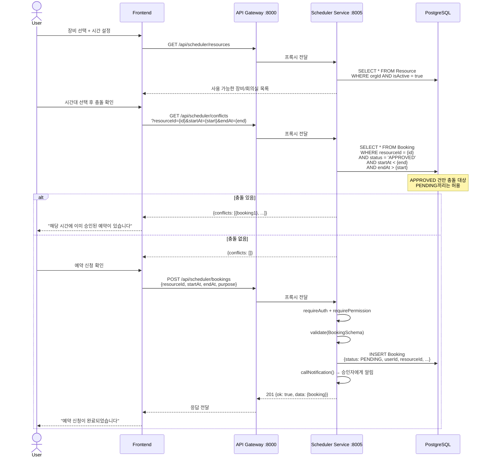
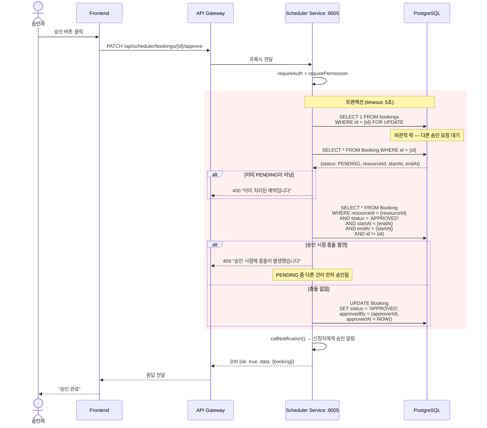
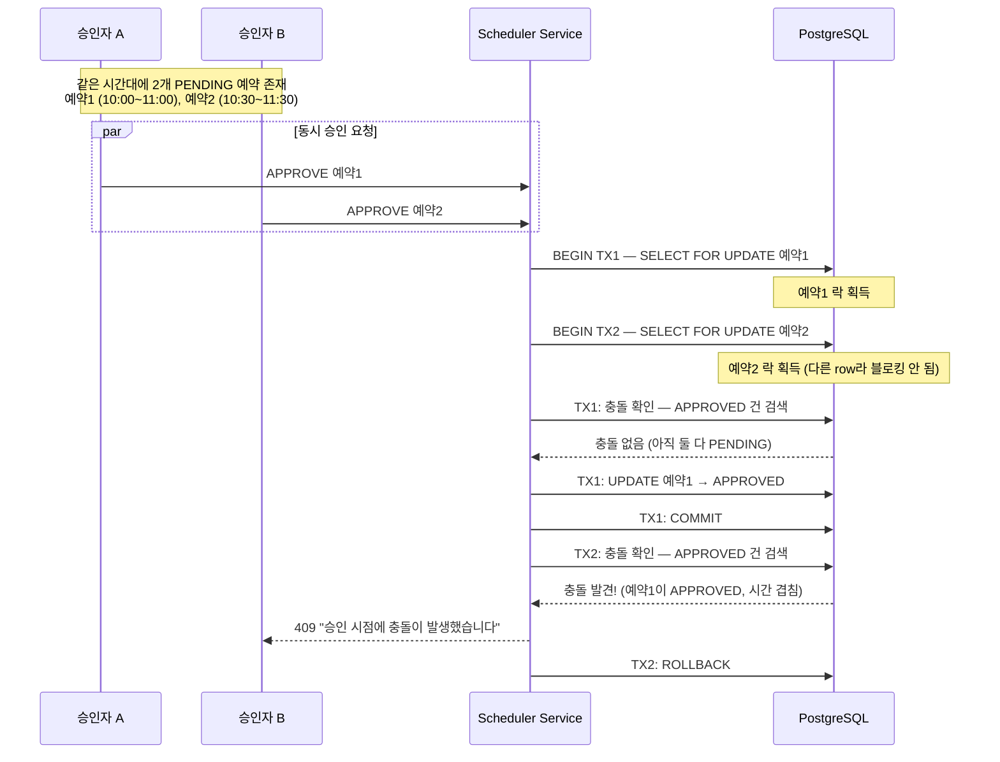

# 장비/회의실 예약 흐름 시퀀스 다이어그램

## 1. 예약 상태 머신



## 2. 예약 생성 흐름



## 3. 예약 승인 (비관적 락)



## 4. 예약 거절 / 취소

```mermaid
sequenceDiagram
    actor Actor as 승인자 / 신청자

    alt 거절 (승인자)
        Actor->>Sched: PATCH /bookings/{id}/reject<br/>{reason: "장비 점검 중"}
        Sched->>Sched: 상태 확인: PENDING → REJECTED ✓
        Sched->>DB: UPDATE status = 'REJECTED'
        Sched->>Sched: callNotification() → 신청자에게 거절 알림
    end

    alt 취소 (신청자)
        Actor->>Sched: PATCH /bookings/{id}/cancel
        Sched->>Sched: 본인 예약 확인 (userId 매칭)
        Sched->>Sched: 상태 확인: PENDING/APPROVED → CANCELLED ✓
        Sched->>DB: UPDATE status = 'CANCELLED'
    end

    alt 완료
        Actor->>Sched: PATCH /bookings/{id}/complete
        Sched->>Sched: 상태 확인: APPROVED → COMPLETED ✓
        Sched->>DB: UPDATE status = 'COMPLETED'
    end

    participant Sched as Scheduler Service
    participant DB as PostgreSQL
```

## 5. 동시 승인 시나리오 (Race Condition 방지)



## 핵심 포인트

| 항목 | 설명 |
|------|------|
| **충돌 기준** | APPROVED 건만 충돌 대상, PENDING끼리는 허용 |
| **비관적 락** | `SELECT ... FOR UPDATE` — 동시 승인 방지 |
| **충돌 재확인** | 승인 시점에 반드시 재검사 (신청~승인 사이 변경 가능) |
| **트랜잭션 타임아웃** | 5초 (락 대기 시간 제한) |
| **취소 권한** | 신청자 본인 또는 Admin |
| **상태 전환** | state-machine.ts에서 허용된 전환만 가능 |
