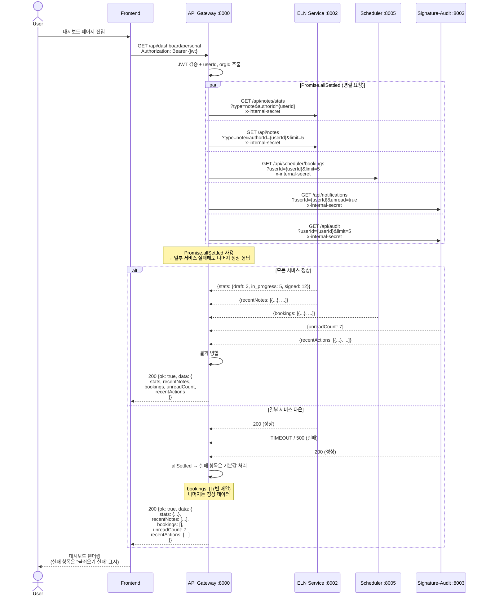
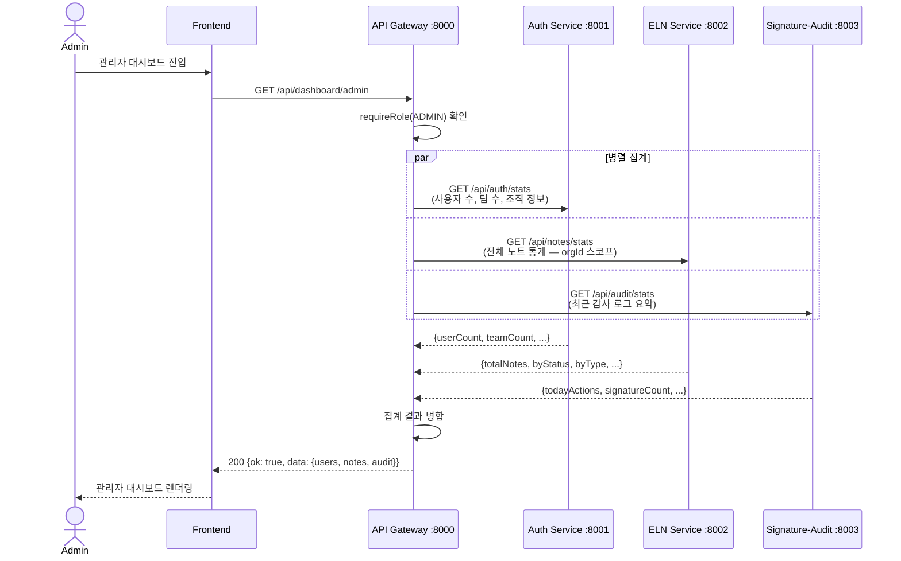
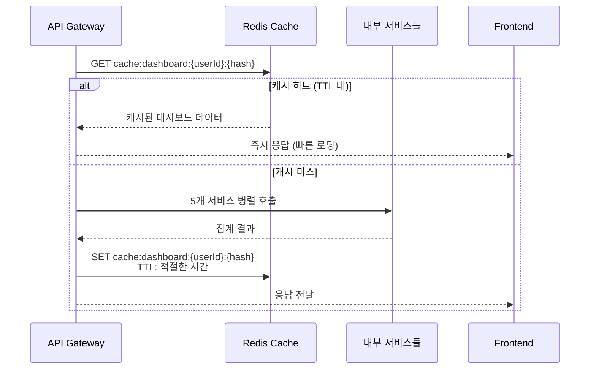

# 대시보드 집계 시퀀스 다이어그램

## 1. 개인 대시보드 조회

## 2. 관리자 대시보드

## 3. 캐싱 전략

## 핵심 포인트

| 항목 | 설명 |
|------|------|
| **병렬 요청** | `Promise.allSettled` — 하나 실패해도 전체 실패 안 함 |
| **Partial Response** | 실패 항목은 빈 배열/기본값으로 대체 |
| **내부 인증** | 모든 요청에 `x-internal-secret` 헤더 |
| **멀티테넌시** | orgId 스코프 자동 필터 |
| **관리자 대시보드** | `requireRole(ADMIN)` 게이트 |
| **캐싱** | Redis TTL 기반, 서비스별 적절한 만료 시간 |
