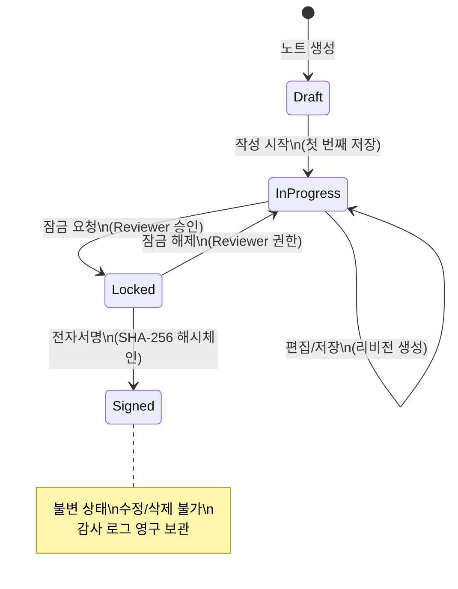
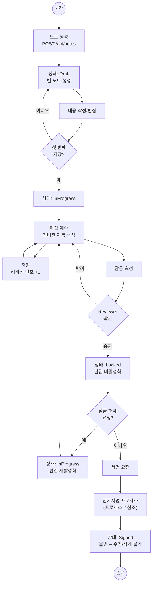
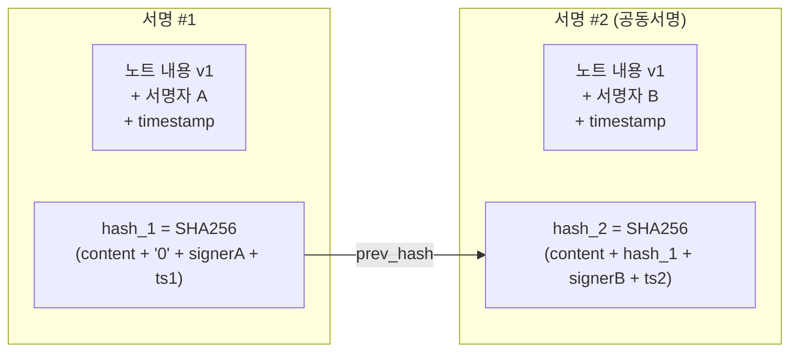
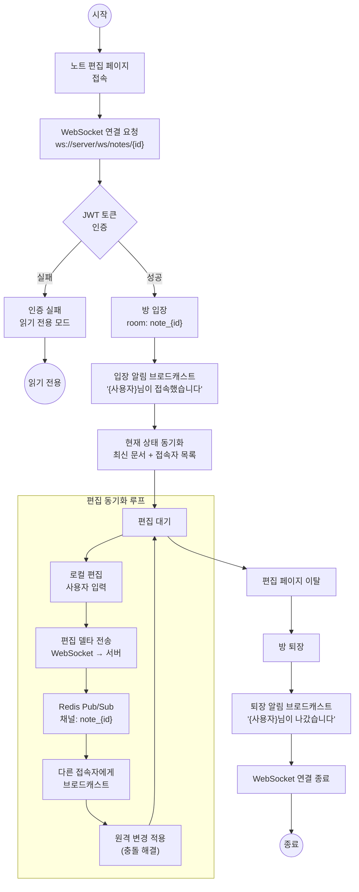
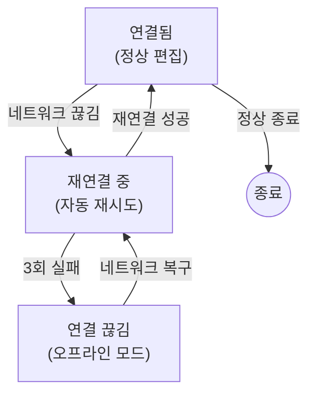
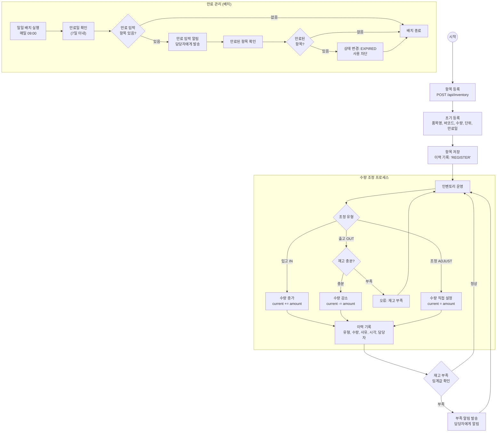
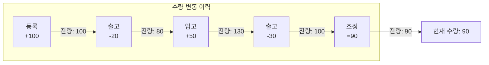

# 프로세스 정의서 — LabNote ELN

## 목차

| # | 프로세스명 | 설명 |
|---|-----------|------|
| 1 | 노트 생명주기 | Draft → InProgress → Locked → Signed (불변) |
| 2 | 전자서명 프로세스 | 서명 요청 → 검증 → 해시체인 → 상태 변경 |
| 3 | 실시간 협업 프로세스 | WebSocket 연결 → 동기화 → 방 관리 |
| 4 | 인벤토리 프로세스 | 등록 → 수량 조정 → 이력 → 알림 |

---

## 1. 노트 생명주기

### 상태 전이도



### 프로세스 흐름도



### 프로세스 상세

| 단계 | 행위자 | 상태 전이 | 처리 | 비고 |
|------|--------|----------|------|------|
| 1. 노트 생성 | 작성자 | [*] → Draft | 빈 노트 엔티티 생성 | 제목 필수 |
| 2. 작성 시작 | 작성자 | Draft → InProgress | 첫 번째 내용 저장 | 리비전 1 생성 |
| 3. 편집/저장 | 작성자/편집자 | InProgress → InProgress | 매 저장 시 리비전 증가 | 자동저장 30초 |
| 4. 잠금 요청 | 작성자 | InProgress → Locked | Reviewer 승인 필요 | 편집 비활성화 |
| 5. 잠금 해제 | Reviewer | Locked → InProgress | 재편집 허용 | 사유 기록 |
| 6. 전자서명 | 서명자 | Locked → Signed | SHA-256 해시체인 생성 | 불변 상태 진입 |

### 리비전 관리


---

## 2. 전자서명 프로세스

### 프로세스 흐름도

```mermaid
flowchart TD
    START((시작)) --> REQUEST_SIGN[서명 요청\n노트 상세에서 버튼 클릭]

    REQUEST_SIGN --> CHECK_STATUS{노트 상태\nLocked?}
    CHECK_STATUS -->|아니오| ERROR_STATUS["오류: Locked 상태에서만\n서명 가능합니다"]
    ERROR_STATUS --> END_FAIL((종료))

    CHECK_STATUS -->|예| INPUT_PW[비밀번호 입력\n(서명자 본인 확인)]
    INPUT_PW --> VERIFY_PW{비밀번호\n검증}
    VERIFY_PW -->|실패| ERROR_PW["오류: 비밀번호가\n올바르지 않습니다"]
    ERROR_PW --> RETRY{재시도?\n(3회 제한)}
    RETRY -->|예| INPUT_PW
    RETRY -->|3회 초과| LOCK_ACCOUNT["계정 임시 잠금\n관리자 알림"]
    LOCK_ACCOUNT --> END_FAIL

    VERIFY_PW -->|성공| GENERATE_HASH[SHA-256 해시 생성]

    subgraph 해시체인_생성["해시체인 생성"]
        GENERATE_HASH --> COLLECT_DATA["데이터 수집\n노트 내용 + 메타데이터\n+ 서명자 정보 + 타임스탬프"]
        COLLECT_DATA --> CALC_HASH["SHA-256 해시 계산\nhash = SHA256(content + prev_hash\n+ signer + timestamp)"]
        CALC_HASH --> CHAIN_LINK["해시체인 연결\n이전 서명의 해시 포함"]
    end

    CHAIN_LINK --> PUBLISH_EVENT["Redis Stream 이벤트 발행\n'note.signed' 이벤트"]

    PUBLISH_EVENT --> UPDATE_STATUS["eln-service 상태 변경\nLocked → Signed"]
    UPDATE_STATUS --> SAVE_SIGNATURE["서명 데이터 저장\n서명자, 시각, 해시값"]
    SAVE_SIGNATURE --> AUDIT_LOG["감사 로그 기록\n서명 이벤트 불변 기록"]
    AUDIT_LOG --> NOTIFY["알림 발송\n관련자에게 서명 완료 통보"]
    NOTIFY --> END_SUCCESS((종료))
```

### 해시체인 구조



### 프로세스 상세

| 단계 | 행위자 | 입력 | 처리 | 출력 |
|------|--------|------|------|------|
| 1. 서명 요청 | 서명자 | 버튼 클릭 | 노트 상태 확인 (Locked) | 비밀번호 모달 |
| 2. 본인 확인 | 서명자 | 비밀번호 | bcrypt 비교 (3회 제한) | 인증 결과 |
| 3. 해시 생성 | 시스템 | 노트 + 메타 | SHA-256(content + prev + signer + ts) | 해시값 |
| 4. 이벤트 발행 | 시스템 | 서명 데이터 | Redis Stream `note.signed` | 이벤트 ID |
| 5. 상태 변경 | eln-service | 이벤트 | Locked → Signed | 상태 업데이트 |
| 6. 감사 로그 | 시스템 | 서명 전체 | 불변 로그 기록 | 감사 레코드 |

---

## 3. 실시간 협업 프로세스

### 프로세스 흐름도



### 연결 상태 관리



### 프로세스 상세

| 단계 | 행위자 | 입력 | 처리 | 출력 |
|------|--------|------|------|------|
| 1. WS 연결 | 클라이언트 | 노트 ID | WebSocket 핸드셰이크 | 연결 수립 |
| 2. JWT 인증 | 서버 | JWT 토큰 | 토큰 검증 + 권한 확인 | 인증 결과 |
| 3. 방 입장 | 서버 | 노트 ID | 방 목록에 사용자 추가 | 접속자 목록 |
| 4. 상태 동기화 | 서버 | - | 최신 문서 상태 전송 | 현재 문서 |
| 5. 편집 동기화 | 클라이언트↔서버 | 편집 델타 | Redis Pub/Sub 브로드캐스트 | 동기화된 문서 |
| 6. 방 퇴장 | 서버 | 연결 종료 | 방 목록에서 제거 | 갱신된 접속자 |

### Redis Pub/Sub 메시지 구조

| 메시지 유형 | 채널 | 페이로드 |
|------------|------|---------|
| edit | `note_{id}` | `{userId, delta, revision}` |
| cursor | `note_{id}` | `{userId, position, selection}` |
| join | `note_{id}` | `{userId, userName, avatarUrl}` |
| leave | `note_{id}` | `{userId}` |

---

## 4. 인벤토리 프로세스

### 전체 프로세스 흐름도



### 수량 조정 이력



### 프로세스 상세

| 단계 | 행위자 | 입력 | 처리 | 출력 |
|------|--------|------|------|------|
| 1. 항목 등록 | 사용자 | 품목 정보 | Inventory 엔티티 생성 | 항목 ID |
| 2. 입고 (IN) | 사용자 | 수량, 사유 | current += amount | 갱신된 수량 |
| 3. 출고 (OUT) | 사용자 | 수량, 사유 | 재고 확인 → current -= amount | 갱신된 수량 |
| 4. 조정 (ADJUST) | 관리자 | 수량, 사유 | current = amount (강제) | 갱신된 수량 |
| 5. 이력 기록 | 시스템 | 변동 정보 | InventoryHistory 생성 | 이력 레코드 |
| 6. 부족 알림 | 시스템 | 현재 수량 | 임계값 비교 → 알림 | 알림 발송 |
| 7. 만료 확인 | 배치 | 만료일 | 7일 이내 → 알림, 초과 → 차단 | 상태 변경 |

### 알림 규칙

| 알림 유형 | 조건 | 수신자 | 채널 |
|----------|------|--------|------|
| 재고 부족 | 현재 수량 < 최소 임계값 | 항목 담당자 | 앱 내 알림 |
| 만료 임박 (7일) | 만료일 - 오늘 ≤ 7일 | 항목 담당자 | 앱 내 알림 |
| 만료 임박 (1일) | 만료일 - 오늘 ≤ 1일 | 항목 담당자 + 관리자 | 앱 내 알림 |
| 만료됨 | 만료일 < 오늘 | 관리자 | 앱 내 알림 |
