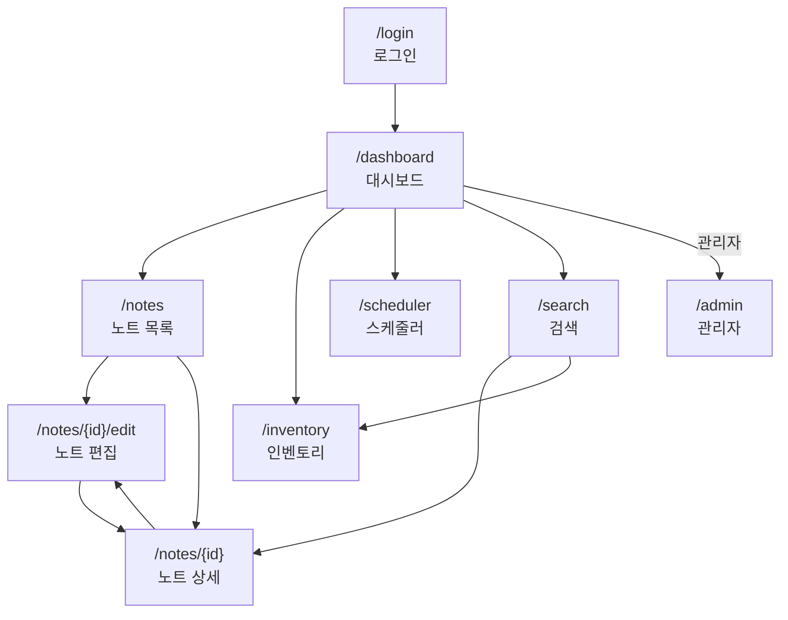
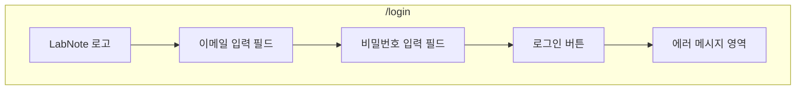
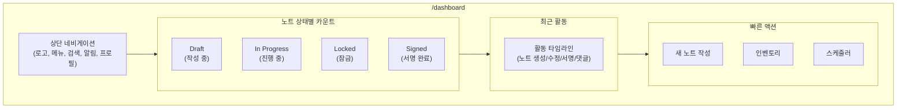
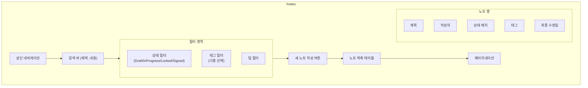
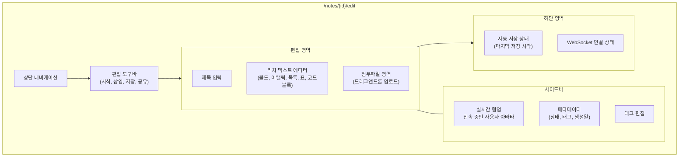
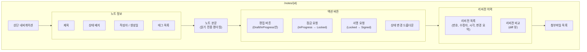
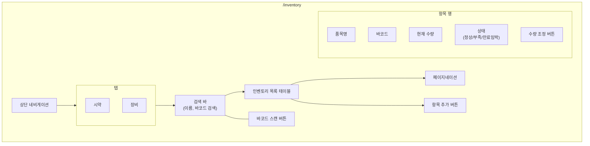
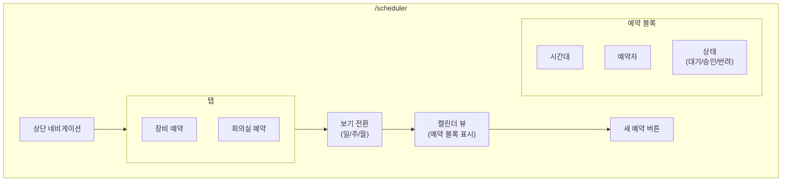
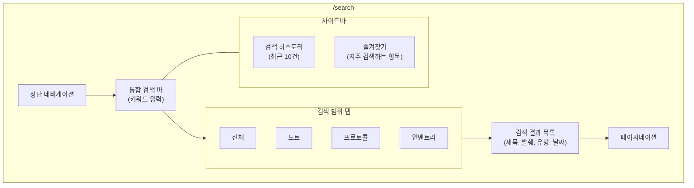
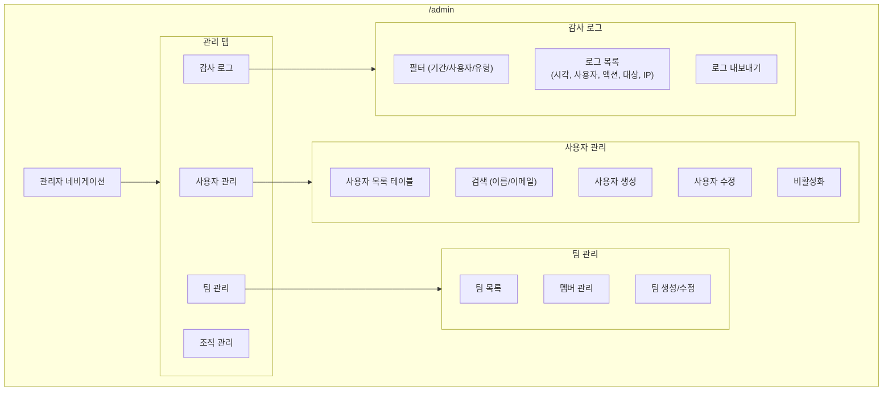

# 화면설계서 — LabNote ELN

## 목차

| # | 페이지명 | URL | 접근 권한 |
|---|---------|-----|----------|
| 1 | 로그인 | `/login` | 비인증 |
| 2 | 대시보드 | `/dashboard` | 전체 회원 |
| 3 | 노트 목록 | `/notes` | 전체 회원 |
| 4 | 노트 편집 | `/notes/{id}/edit` | 작성자/공동편집자 |
| 5 | 노트 상세 | `/notes/{id}` | 팀 멤버 |
| 6 | 인벤토리 | `/inventory` | 전체 회원 |
| 7 | 스케줄러 | `/scheduler` | 전체 회원 |
| 8 | 검색 | `/search` | 전체 회원 |
| 9 | 관리자 | `/admin` | 관리자 |

---

## 전체 화면 흐름도

---

## 1. 로그인

| 항목 | 내용 |
|------|------|
| **URL** | `/login` |
| **접근 권한** | 비인증 사용자 |

### 화면 구성

### 주요 컴포넌트

| 컴포넌트 | 설명 |
|----------|------|
| 로고 영역 | LabNote 로고 + 시스템 타이틀 |
| 이메일 입력 | `type="email"`, 조직 이메일 |
| 비밀번호 입력 | `type="password"` |
| 로그인 버튼 | Primary 버튼, 엔터키 바인딩 |
| 에러 메시지 | 인증 실패 시 표시 |

### 입력 필드

| 필드명 | 타입 | 필수 | 유효성 검사 |
|--------|------|------|-------------|
| email | string | O | 이메일 형식 |
| password | string | O | 최소 8자 |

### 사용자 액션

| 액션 | 동작 |
|------|------|
| 로그인 클릭 | POST `/api/auth/login` → JWT 발급 → `/dashboard` 리다이렉트 |
| 엔터 입력 | 로그인 실행 |

---

## 2. 대시보드

| 항목 | 내용 |
|------|------|
| **URL** | `/dashboard` |
| **접근 권한** | 전체 회원 |

### 화면 구성

### 주요 컴포넌트

| 컴포넌트 | 설명 |
|----------|------|
| 상태별 카운트 카드 | Draft / In Progress / Locked / Signed 각각의 건수 |
| 최근 활동 타임라인 | 시간순 활동 내역 (노트 생성, 수정, 서명, 댓글 등) |
| 빠른 액션 버튼 | 새 노트, 인벤토리, 스케줄러 바로가기 |
| 알림 아이콘 | 미읽은 알림 배지 카운트 |

### 출력 데이터

| 데이터 | 설명 |
|--------|------|
| 노트 상태별 수 | 각 상태의 노트 건수 |
| 최근 활동 | 최근 10건의 활동 (시간, 사용자, 유형, 대상) |
| 알림 수 | 미읽은 알림 건수 |

### 사용자 액션

| 액션 | 동작 |
|------|------|
| 상태 카드 클릭 | `/notes?status={상태}`로 이동 |
| 새 노트 작성 | 노트 생성 → `/notes/{id}/edit`로 이동 |
| 활동 항목 클릭 | 해당 노트/리소스로 이동 |

---

## 3. 노트 목록

| 항목 | 내용 |
|------|------|
| **URL** | `/notes` |
| **접근 권한** | 전체 회원 (팀 범위 내) |

### 화면 구성

### 주요 컴포넌트

| 컴포넌트 | 설명 |
|----------|------|
| 검색 바 | 제목/내용 전문 검색 |
| 상태 필터 | 탭 방식: 전체/Draft/InProgress/Locked/Signed |
| 태그 필터 | 다중 선택 드롭다운 |
| 팀 필터 | 소속 팀 또는 전체 |
| 노트 목록 | 제목, 작성자, 상태, 태그, 최종 수정일 |
| 페이지네이션 | 20건 단위, 페이지 번호 |

### 출력 데이터

| 컬럼 | 타입 | 설명 |
|------|------|------|
| 제목 | string | 노트 제목 (링크) |
| 작성자 | string | 작성자 이름 |
| 상태 | enum | DRAFT / IN_PROGRESS / LOCKED / SIGNED |
| 태그 | string[] | 태그 배지 목록 |
| 최종 수정일 | datetime | 마지막 수정 시각 |

### 사용자 액션

| 액션 | 동작 |
|------|------|
| 새 노트 작성 | POST → `/notes/{id}/edit`로 이동 |
| 노트 클릭 | `/notes/{id}`로 이동 |
| 필터/검색 | 목록 갱신 |

---

## 4. 노트 편집

| 항목 | 내용 |
|------|------|
| **URL** | `/notes/{id}/edit` |
| **접근 권한** | 작성자 / 공동편집자 (Draft, InProgress 상태만) |

### 화면 구성

### 주요 컴포넌트

| 컴포넌트 | 설명 |
|----------|------|
| 리치 텍스트 에디터 | 볼드, 이탤릭, 목록, 표, 코드블록, 수식 지원 |
| 실시간 협업 표시 | WebSocket 기반, 접속자 아바타 + 커서 위치 |
| 첨부파일 업로드 | 드래그앤드롭, 이미지/문서/데이터파일 |
| 자동 저장 | 30초 간격 자동 저장 + 수동 저장 (Ctrl+S) |
| 태그 편집 | 태그 추가/제거 (자동완성) |
| WebSocket 상태 | 연결/재연결/오프라인 표시 |

### 입력 필드

| 필드명 | 타입 | 필수 | 설명 |
|--------|------|------|------|
| title | string | O | 노트 제목 |
| content | richtext | X | 노트 본문 (HTML/Delta) |
| tags | string[] | X | 태그 목록 |
| attachments | file[] | X | 첨부파일 (최대 50MB/파일) |

### 출력 데이터

| 데이터 | 설명 |
|--------|------|
| 접속 사용자 | 현재 편집 중인 사용자 목록 |
| 자동 저장 시각 | 마지막 저장 타임스탬프 |
| 리비전 번호 | 현재 리비전 |

### 사용자 액션

| 액션 | 동작 |
|------|------|
| 내용 편집 | 리치 텍스트 편집 → WebSocket으로 동기화 |
| Ctrl+S | 수동 저장 |
| 파일 첨부 | 드래그앤드롭 또는 버튼 클릭 → 업로드 |
| 태그 추가 | 태그 입력 → 자동완성 선택 |
| 상세 보기 | `/notes/{id}`로 이동 |

---

## 5. 노트 상세

| 항목 | 내용 |
|------|------|
| **URL** | `/notes/{id}` |
| **접근 권한** | 팀 멤버 (읽기) |

### 화면 구성

### 주요 컴포넌트

| 컴포넌트 | 설명 |
|----------|------|
| 상태 배지 | Draft(회색)/InProgress(파랑)/Locked(주황)/Signed(초록) |
| 본문 렌더링 | 리치 텍스트 읽기 전용 표시 |
| 편집 버튼 | Draft/InProgress 상태에서만 활성화 |
| 잠금 요청 | Reviewer에게 잠금 요청 |
| 서명 요청 | 전자서명 프로세스 시작 |
| 리비전 이력 | 시간순 리비전 목록 + diff 비교 |
| 첨부파일 | 파일명, 크기, 다운로드 링크 |

### 출력 데이터

| 데이터 | 설명 |
|--------|------|
| 노트 본문 | HTML 렌더링 |
| 리비전 목록 | 번호, 수정자, 시각, 변경 크기 |
| 서명 정보 | 서명자, 시각, 해시값 (Signed 상태) |

### 사용자 액션

| 액션 | 동작 |
|------|------|
| 편집 클릭 | `/notes/{id}/edit`로 이동 |
| 잠금 요청 | 상태 → LOCKED, 편집 비활성화 |
| 서명 요청 | 비밀번호 확인 모달 → 전자서명 프로세스 |
| 리비전 비교 | 두 리비전 선택 → diff 표시 |
| 첨부파일 다운로드 | 파일 다운로드 |

---

## 6. 인벤토리

| 항목 | 내용 |
|------|------|
| **URL** | `/inventory` |
| **접근 권한** | 전체 회원 |

### 화면 구성

### 주요 컴포넌트

| 컴포넌트 | 설명 |
|----------|------|
| 시약/장비 탭 | 시약과 장비를 분리 표시 |
| 검색 바 | 품목명 또는 바코드로 검색 |
| 바코드 스캔 | 카메라 또는 스캐너로 바코드 인식 |
| 인벤토리 테이블 | 품목명, 바코드, 수량, 상태, 만료일, 액션 |
| 수량 조정 모달 | 입고(in)/출고(out)/조정(adjust) 선택 |
| 상태 표시 | 정상(초록)/부족(빨강)/만료임박(주황) |

### 입력 필드 (항목 추가/수량 조정)

| 필드명 | 타입 | 필수 | 설명 |
|--------|------|------|------|
| name | string | O | 품목명 |
| barcode | string | X | 바코드 번호 |
| category | enum | O | 시약/장비 |
| quantity | number | O | 초기 수량 |
| unit | string | O | 단위 (ml, g, ea 등) |
| expiryDate | date | X | 만료일 (시약) |
| adjustType | enum | O (조정 시) | IN / OUT / ADJUST |
| adjustAmount | number | O (조정 시) | 조정 수량 |
| reason | string | O (조정 시) | 조정 사유 |

### 사용자 액션

| 액션 | 동작 |
|------|------|
| 항목 추가 | 추가 모달 → POST `/api/inventory` |
| 수량 조정 | 조정 모달 → POST `/api/inventory/{id}/adjust` |
| 바코드 스캔 | 카메라 활성화 → 항목 검색 |
| 행 클릭 | 항목 상세 + 이력 표시 |

---

## 7. 스케줄러

| 항목 | 내용 |
|------|------|
| **URL** | `/scheduler` |
| **접근 권한** | 전체 회원 |

### 화면 구성

### 주요 컴포넌트

| 컴포넌트 | 설명 |
|----------|------|
| 장비/회의실 탭 | 리소스 유형별 탭 전환 |
| 캘린더 뷰 | 일간/주간/월간 보기 전환 |
| 예약 블록 | 시간대별 예약 표시 (색상으로 상태 구분) |
| 새 예약 모달 | 리소스 선택, 시간 지정, 목적 입력 |
| 승인 워크플로우 | 관리자/장비 담당자 승인 필요 |

### 입력 필드 (예약 생성)

| 필드명 | 타입 | 필수 | 설명 |
|--------|------|------|------|
| resourceId | number | O | 장비 또는 회의실 ID |
| startTime | datetime | O | 시작 시각 |
| endTime | datetime | O | 종료 시각 |
| purpose | string | O | 예약 목적 |

### 사용자 액션

| 액션 | 동작 |
|------|------|
| 캘린더 빈 공간 클릭 | 해당 시간대로 예약 모달 |
| 예약 생성 | POST `/api/reservations` → 승인 대기 |
| 예약 블록 클릭 | 예약 상세 팝오버 |
| 예약 취소 | 본인 예약만 취소 가능 |
| 승인/반려 (관리자) | PATCH 상태 변경 |

---

## 8. 검색

| 항목 | 내용 |
|------|------|
| **URL** | `/search` |
| **접근 권한** | 전체 회원 |

### 화면 구성

### 주요 컴포넌트

| 컴포넌트 | 설명 |
|----------|------|
| 통합 검색 바 | 키워드 기반 전문 검색 (엔터 또는 자동 검색) |
| 검색 범위 탭 | 전체/노트/프로토콜/인벤토리 필터 |
| 검색 결과 | 제목, 본문 발췌(하이라이트), 유형 아이콘, 날짜 |
| 검색 히스토리 | 최근 10건 자동 저장 |
| 즐겨찾기 | 별표한 검색어 목록 |

### 입력 필드

| 필드명 | 타입 | 필수 | 설명 |
|--------|------|------|------|
| keyword | string | O | 검색 키워드 |
| scope | enum | X | ALL / NOTES / PROTOCOLS / INVENTORY |

### 출력 데이터

| 데이터 | 설명 |
|--------|------|
| 결과 건수 | 범위별 매칭 건수 |
| 결과 목록 | 제목, 발췌(키워드 하이라이트), 유형, 날짜 |
| 검색 히스토리 | 최근 검색어 10건 |

### 사용자 액션

| 액션 | 동작 |
|------|------|
| 검색 실행 | 엔터 또는 자동 검색 |
| 탭 전환 | 해당 범위로 결과 필터 |
| 결과 클릭 | 해당 리소스 상세 페이지로 이동 |
| 즐겨찾기 추가 | 검색어 옆 별표 클릭 |
| 히스토리 클릭 | 해당 검색어로 재검색 |

---

## 9. 관리자

| 항목 | 내용 |
|------|------|
| **URL** | `/admin` |
| **접근 권한** | 관리자 |

### 화면 구성

### 주요 컴포넌트

| 컴포넌트 | 설명 |
|----------|------|
| 사용자 관리 | CRUD + 역할 변경 + 비활성화 |
| 팀 관리 | 팀 생성, 멤버 추가/제거 |
| 조직 관리 | 조직 설정, 정책 관리 |
| 감사 로그 | 전체 시스템 활동 이력 (불변) |

### 감사 로그 출력

| 컬럼 | 타입 | 설명 |
|------|------|------|
| 시각 | datetime | 이벤트 발생 시각 |
| 사용자 | string | 행위자 |
| 액션 | enum | CREATE/READ/UPDATE/DELETE/SIGN/EXPORT |
| 대상 | string | 리소스 유형 + ID |
| IP 주소 | string | 클라이언트 IP |
| 상세 | JSON | 변경 전후 데이터 |

### 사용자 액션

| 액션 | 동작 |
|------|------|
| 사용자 생성 | 모달 → POST `/api/admin/users` |
| 사용자 수정 | 모달 → PUT `/api/admin/users/{id}` |
| 팀 생성 | 모달 → POST `/api/admin/teams` |
| 멤버 추가 | 사용자 검색 → 팀에 추가 |
| 감사 로그 필터 | 조건별 필터 → 목록 갱신 |
| 로그 내보내기 | CSV 다운로드 |
