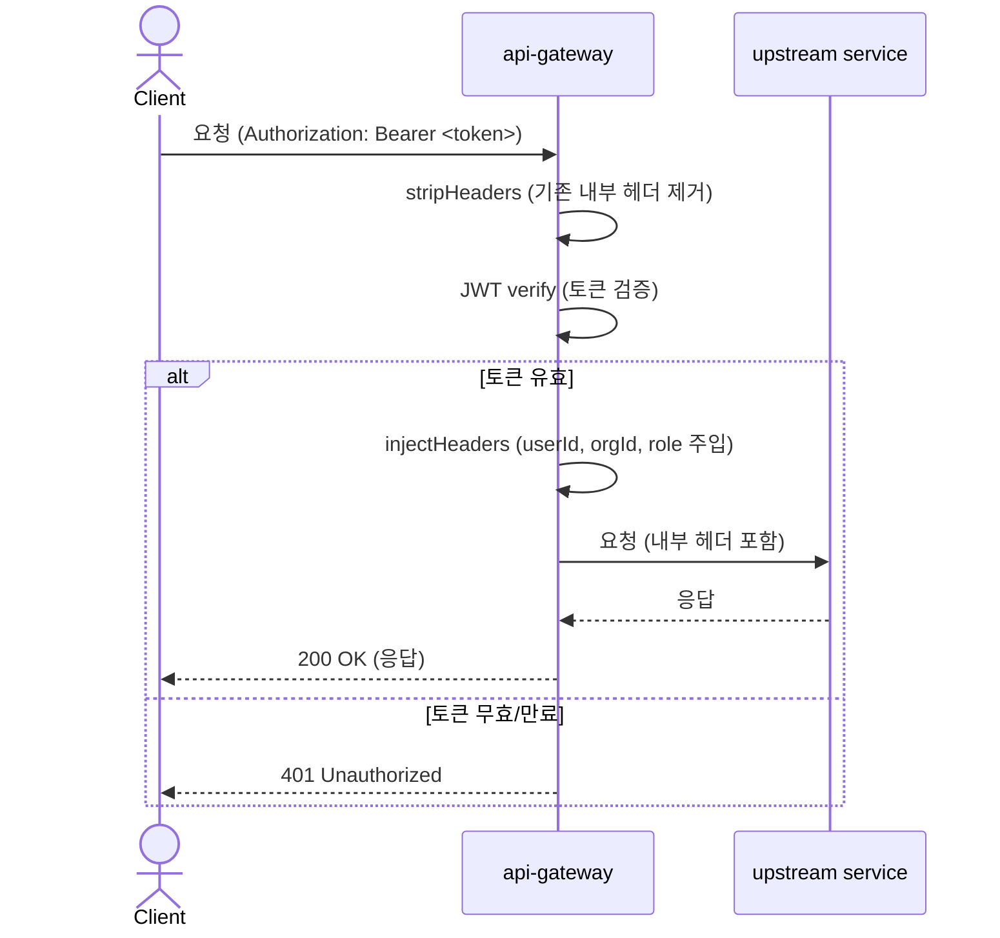
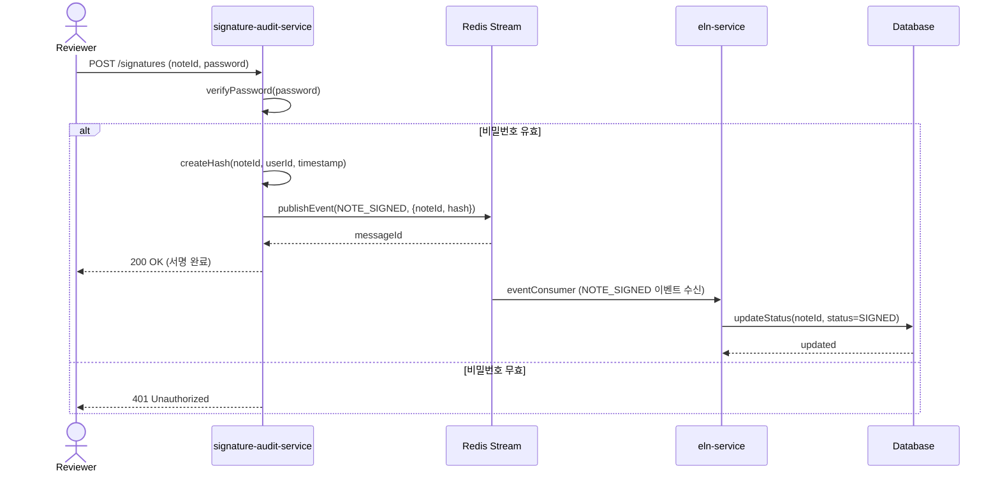
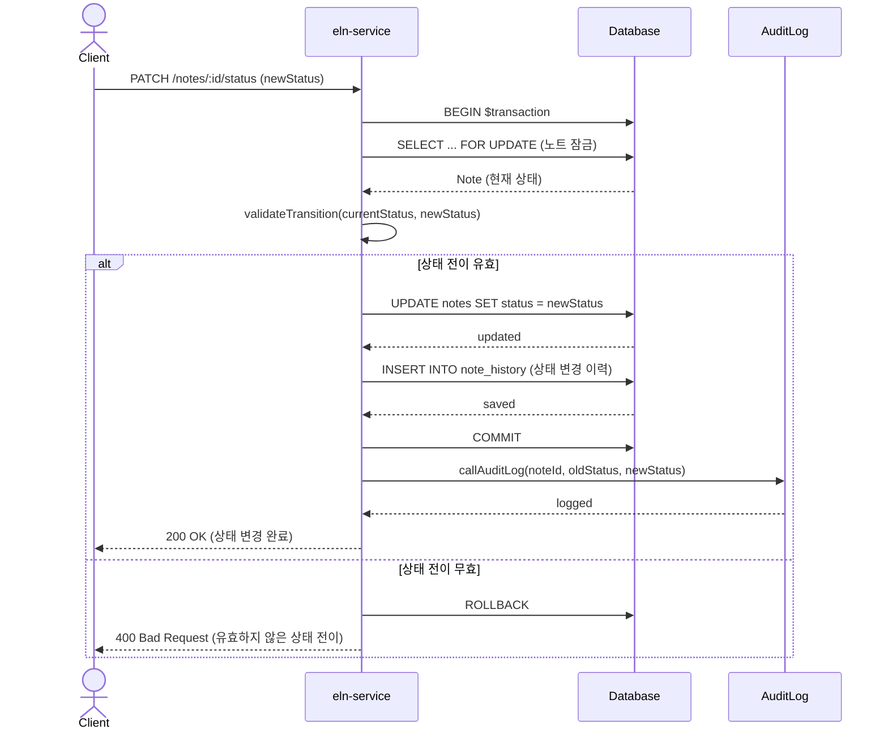
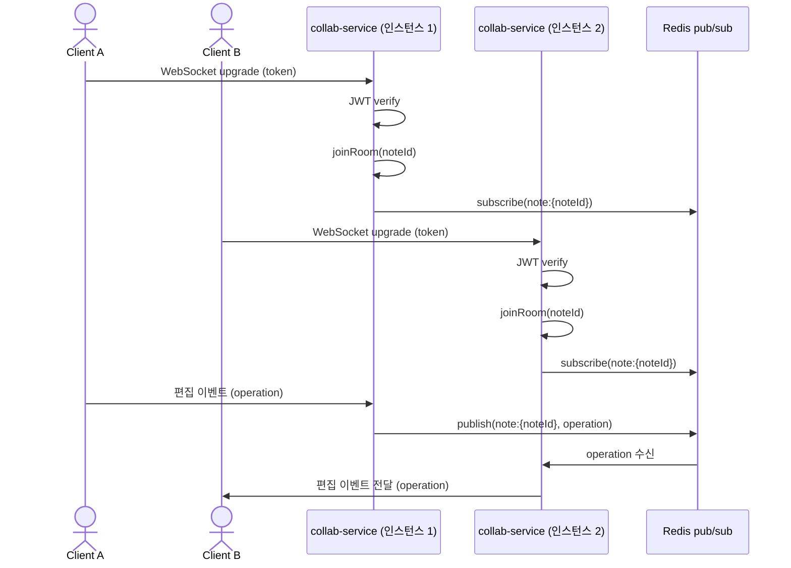
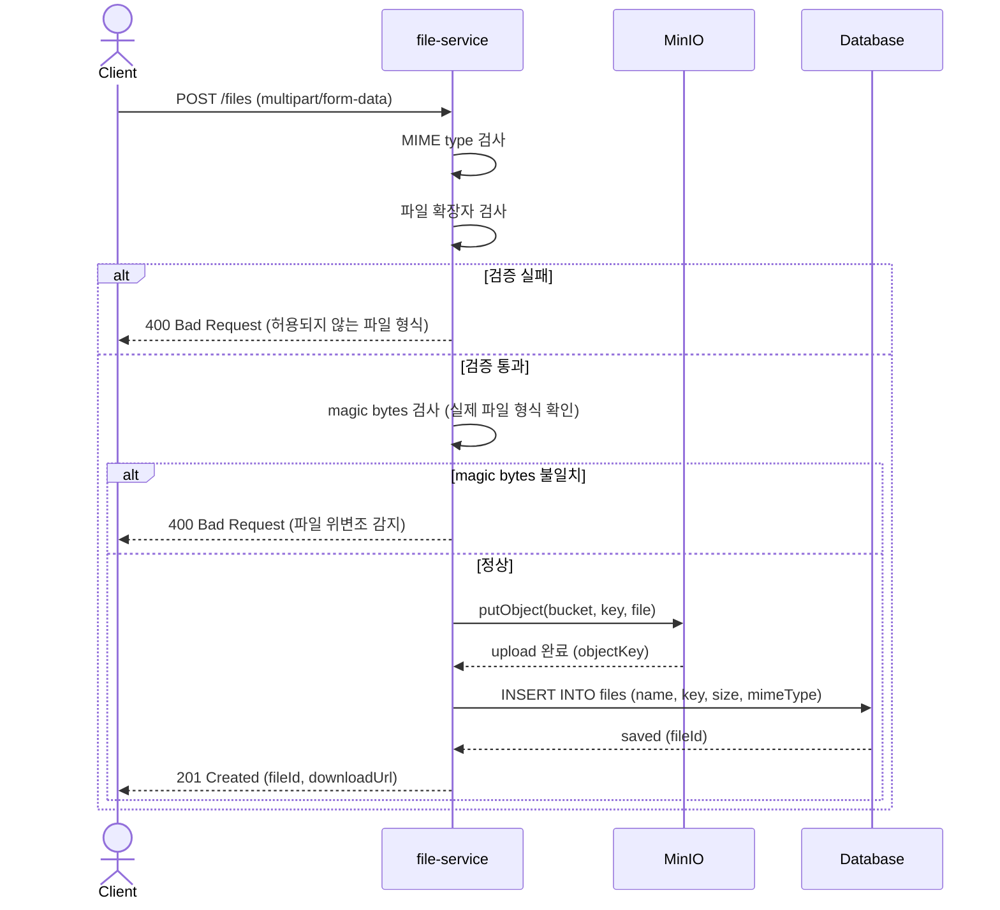

# 주요 시퀀스 다이어그램

## 1. JWT 인증 플로우

```mermaid
sequenceDiagram
    actor Client
    participant APIGateway as api-gateway
    participant UpstreamService as upstream service

    Client->>APIGateway: 요청 (Authorization: Bearer <token>)
    APIGateway->>APIGateway: stripHeaders (기존 내부 헤더 제거)
    APIGateway->>APIGateway: JWT verify (토큰 검증)

    alt 토큰 유효
        APIGateway->>APIGateway: injectHeaders (userId, orgId, role 주입)
        APIGateway->>UpstreamService: 요청 (내부 헤더 포함)
        UpstreamService-->>APIGateway: 응답
        APIGateway-->>Client: 200 OK (응답)
    else 토큰 무효/만료
        APIGateway-->>Client: 401 Unauthorized
    end
```

## 2. 노트 서명 플로우

```mermaid
sequenceDiagram
    actor Reviewer
    participant SignatureAuditService as signature-audit-service
    participant RedisStream as Redis Stream
    participant ElnService as eln-service
    participant Database

    Reviewer->>SignatureAuditService: POST /signatures (noteId, password)
    SignatureAuditService->>SignatureAuditService: verifyPassword(password)

    alt 비밀번호 유효
        SignatureAuditService->>SignatureAuditService: createHash(noteId, userId, timestamp)
        SignatureAuditService->>RedisStream: publishEvent(NOTE_SIGNED, {noteId, hash})
        RedisStream-->>SignatureAuditService: messageId
        SignatureAuditService-->>Reviewer: 200 OK (서명 완료)

        RedisStream->>ElnService: eventConsumer (NOTE_SIGNED 이벤트 수신)
        ElnService->>Database: updateStatus(noteId, status=SIGNED)
        Database-->>ElnService: updated
    else 비밀번호 무효
        SignatureAuditService-->>Reviewer: 401 Unauthorized
    end
```

## 3. 노트 상태 변경

```mermaid
sequenceDiagram
    actor Client
    participant ElnService as eln-service
    participant Database
    participant AuditLog

    Client->>ElnService: PATCH /notes/:id/status (newStatus)
    ElnService->>Database: BEGIN $transaction
    ElnService->>Database: SELECT ... FOR UPDATE (노트 잠금)
    Database-->>ElnService: Note (현재 상태)
    ElnService->>ElnService: validateTransition(currentStatus, newStatus)

    alt 상태 전이 유효
        ElnService->>Database: UPDATE notes SET status = newStatus
        Database-->>ElnService: updated
        ElnService->>Database: INSERT INTO note_history (상태 변경 이력)
        Database-->>ElnService: saved
        ElnService->>Database: COMMIT
        ElnService->>AuditLog: callAuditLog(noteId, oldStatus, newStatus)
        AuditLog-->>ElnService: logged
        ElnService-->>Client: 200 OK (상태 변경 완료)
    else 상태 전이 무효
        ElnService->>Database: ROLLBACK
        ElnService-->>Client: 400 Bad Request (유효하지 않은 상태 전이)
    end
```

## 4. 실시간 협업

```mermaid
sequenceDiagram
    actor Client1 as Client A
    actor Client2 as Client B
    participant CollabService1 as collab-service (인스턴스 1)
    participant CollabService2 as collab-service (인스턴스 2)
    participant RedisPubSub as Redis pub/sub

    Client1->>CollabService1: WebSocket upgrade (token)
    CollabService1->>CollabService1: JWT verify
    CollabService1->>CollabService1: joinRoom(noteId)
    CollabService1->>RedisPubSub: subscribe(note:{noteId})

    Client2->>CollabService2: WebSocket upgrade (token)
    CollabService2->>CollabService2: JWT verify
    CollabService2->>CollabService2: joinRoom(noteId)
    CollabService2->>RedisPubSub: subscribe(note:{noteId})

    Client1->>CollabService1: 편집 이벤트 (operation)
    CollabService1->>RedisPubSub: publish(note:{noteId}, operation)
    RedisPubSub->>CollabService2: operation 수신
    CollabService2->>Client2: 편집 이벤트 전달 (operation)
```

## 5. 파일 업로드

```mermaid
sequenceDiagram
    actor Client
    participant FileService as file-service
    participant MinIO
    participant Database

    Client->>FileService: POST /files (multipart/form-data)
    FileService->>FileService: MIME type 검사
    FileService->>FileService: 파일 확장자 검사

    alt 검증 실패
        FileService-->>Client: 400 Bad Request (허용되지 않는 파일 형식)
    else 검증 통과
        FileService->>FileService: magic bytes 검사 (실제 파일 형식 확인)

        alt magic bytes 불일치
            FileService-->>Client: 400 Bad Request (파일 위변조 감지)
        else 정상
            FileService->>MinIO: putObject(bucket, key, file)
            MinIO-->>FileService: upload 완료 (objectKey)
            FileService->>Database: INSERT INTO files (name, key, size, mimeType)
            Database-->>FileService: saved (fileId)
            FileService-->>Client: 201 Created (fileId, downloadUrl)
        end
    end
```
