# LabNote ELN - 시퀀스 다이어그램

> 전자연구노트(ELN) 협업 플랫폼의 핵심 흐름 8가지를 시퀀스 다이어그램으로 정리한 문서입니다.

---

## 목차

1. [로그인 / 토큰 갱신 / 로그아웃](#1-로그인--토큰-갱신--로그아웃)
2. [연구노트 작성 및 저장](#2-연구노트-작성-및-저장)
3. [실시간 협업 편집](#3-실시간-협업-편집)
4. [전자서명 → 상태 전환](#4-전자서명--상태-전환)
5. [관리자 잠금 해제](#5-관리자-잠금-해제)
6. [PDF/ZIP 내보내기](#6-pdfzip-내보내기)
7. [통합 검색](#7-통합-검색)
8. [인벤토리 수량 변경 및 재고 경고](#8-인벤토리-수량-변경-및-재고-경고)

---

## 1. 로그인 / 토큰 갱신 / 로그아웃

### 1-1. 로그인

```mermaid
sequenceDiagram
    actor User as 사용자
    participant FE as Frontend<br/>(React)
    participant GW as API Gateway<br/>(:8000)
    participant Auth as Auth Service<br/>(:8001)
    participant DB as PostgreSQL<br/>(auth schema)
    participant Redis as Redis

    User->>FE: 이메일/비밀번호 입력 후 로그인 클릭
    FE->>GW: POST /api/auth/login<br/>{email, password}
    Note over GW: 공개 경로 — JWT 검증 생략
    GW->>Auth: 프록시 전달

    Auth->>DB: SELECT user WHERE email<br/>(+ role, teams 조인)
    DB-->>Auth: 사용자 정보
    Auth->>Auth: bcrypt.compare(password, hash)
    alt 비밀번호 불일치 또는 비활성 계정
        Auth-->>FE: 401 {ok:false, error:"이메일 또는 비밀번호가 올바르지 않습니다"}
    end
    Auth->>Auth: Access Token 생성 (15분)<br/>payload: sub, email, role, permissions, orgId, teams
    Auth->>Auth: Refresh Token 생성 (8시간)<br/>payload: sub, type:'refresh'
    Auth-->>GW: {ok:true, data:{token, refreshToken, user}}
    GW-->>FE: 응답 전달

    FE->>FE: Access Token → 메모리 저장
    FE->>GW: POST /api/auth/session<br/>{refreshToken}
    GW->>GW: Set-Cookie: labnote_rt={refreshToken}<br/>HttpOnly; Secure; SameSite=Strict; Path=/api/auth/session; Max-Age=28800
    GW-->>FE: 200 OK
    FE->>User: 대시보드로 이동
```

### 1-2. 토큰 갱신 (자동)

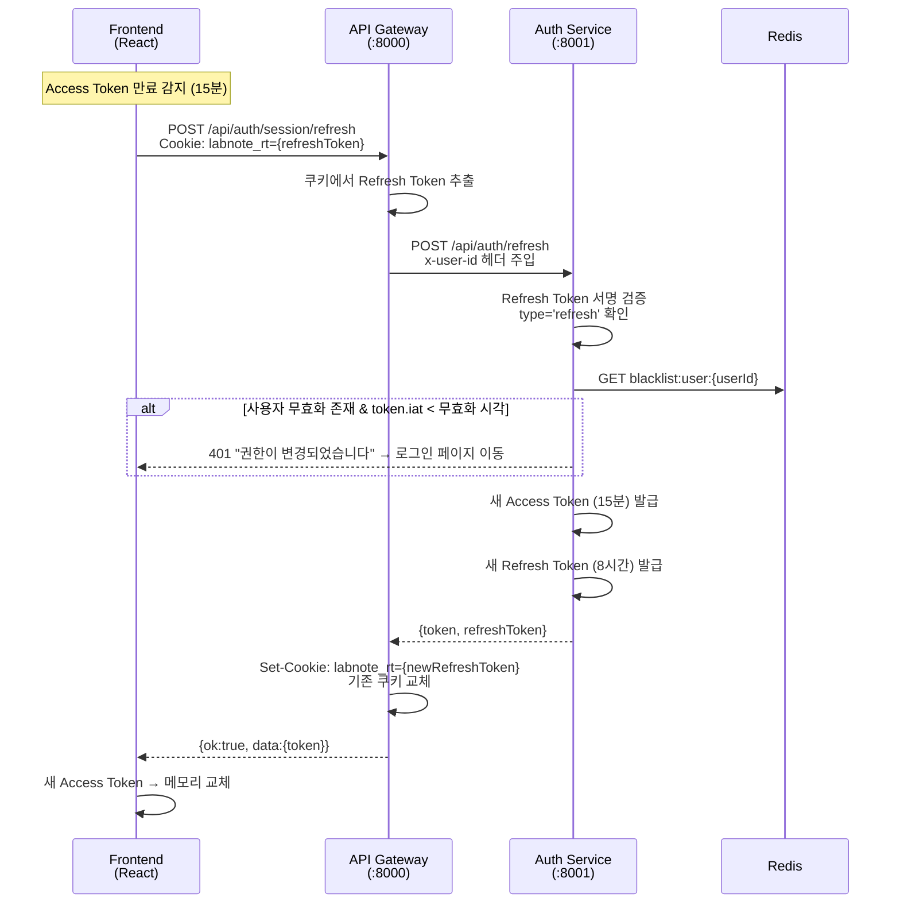

### 1-3. 로그아웃

```mermaid
sequenceDiagram
    actor User as 사용자
    participant FE as Frontend<br/>(React)
    participant GW as API Gateway<br/>(:8000)
    participant Auth as Auth Service<br/>(:8001)
    participant Redis as Redis

    User->>FE: 로그아웃 클릭
    FE->>GW: POST /api/auth/logout<br/>Authorization: Bearer {accessToken}
    GW->>Auth: 프록시 전달
    Auth->>Auth: 토큰에서 만료시각(exp) 추출
    Auth->>Redis: SET blacklist:{token} "1"<br/>TTL = 남은 만료 시간
    Auth-->>GW: {ok:true}

    FE->>GW: DELETE /api/auth/session
    GW->>GW: Set-Cookie: labnote_rt=;<br/>Max-Age=0 (쿠키 삭제)
    GW-->>FE: 200 OK
    FE->>FE: 메모리의 Access Token 삭제
    FE->>User: 로그인 페이지로 이동
```

### 1-4. API 요청 시 Gateway JWT 검증

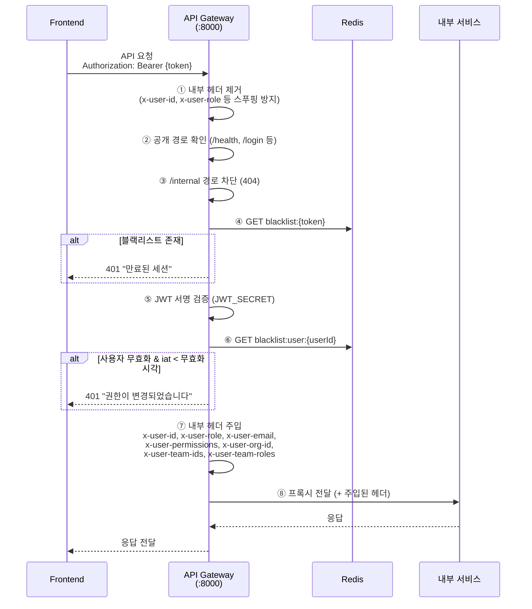

---

## 2. 연구노트 작성 및 저장

### 2-1. 노트 생성

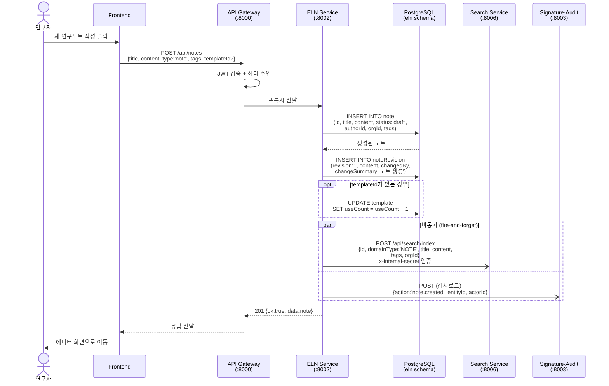

### 2-2. 노트 수정 (저장)

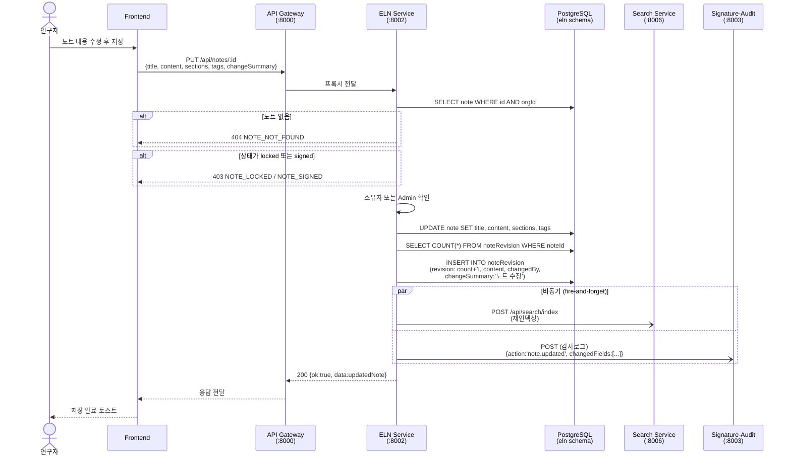

---

## 3. 실시간 협업 편집

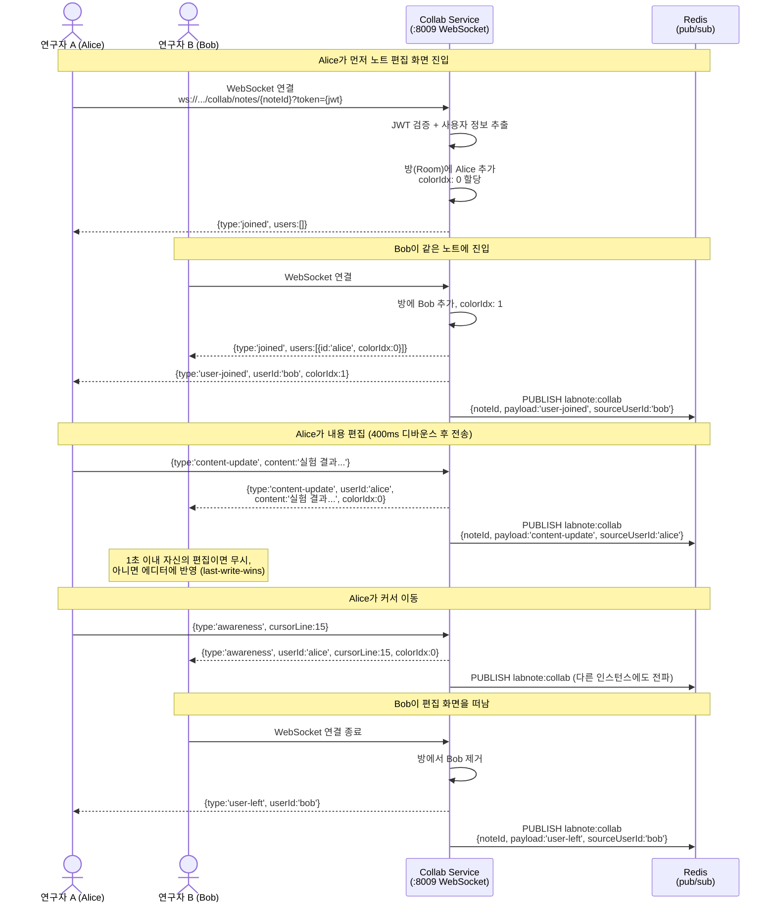

---

## 4. 전자서명 → 상태 전환

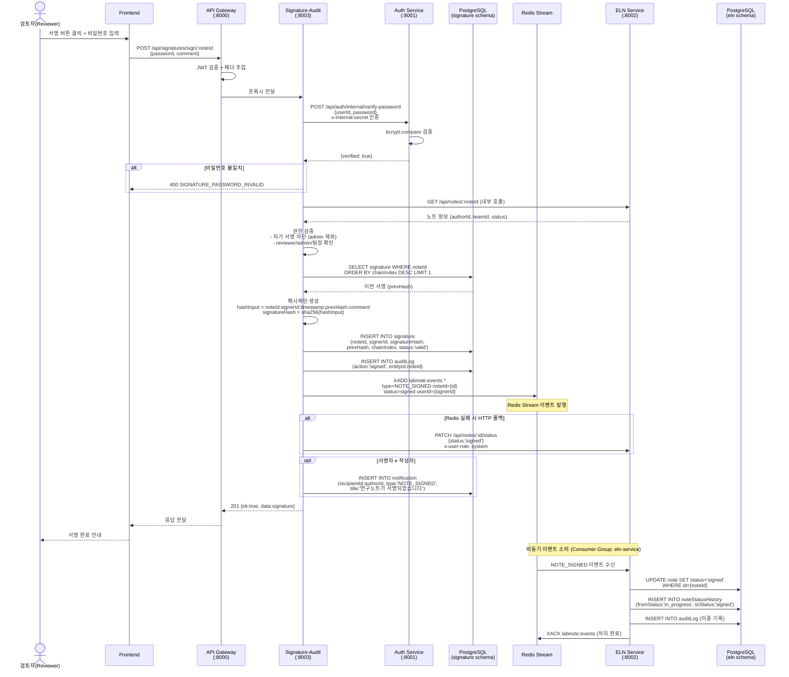

---

## 5. 관리자 잠금 해제

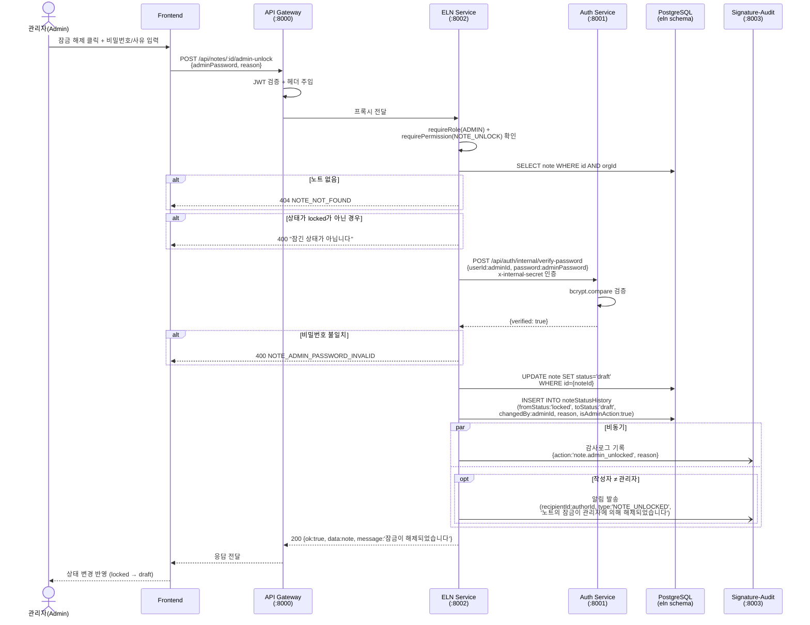

---

## 6. PDF/ZIP 내보내기

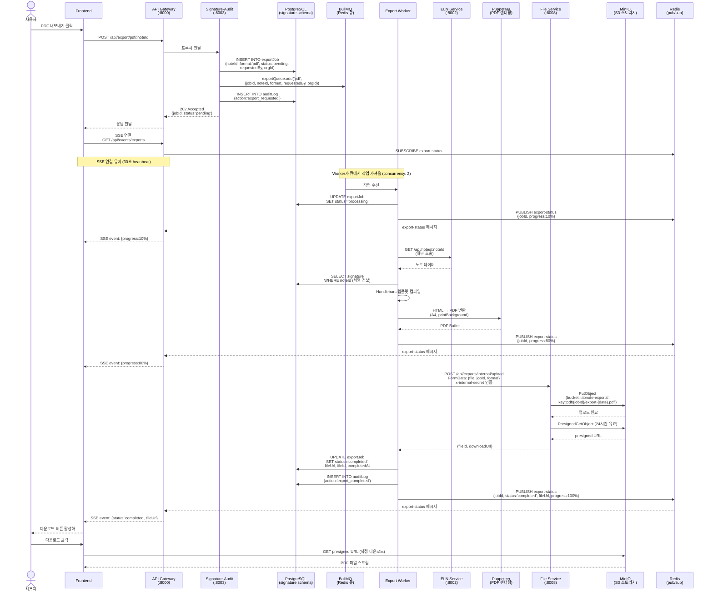

---

## 7. 통합 검색

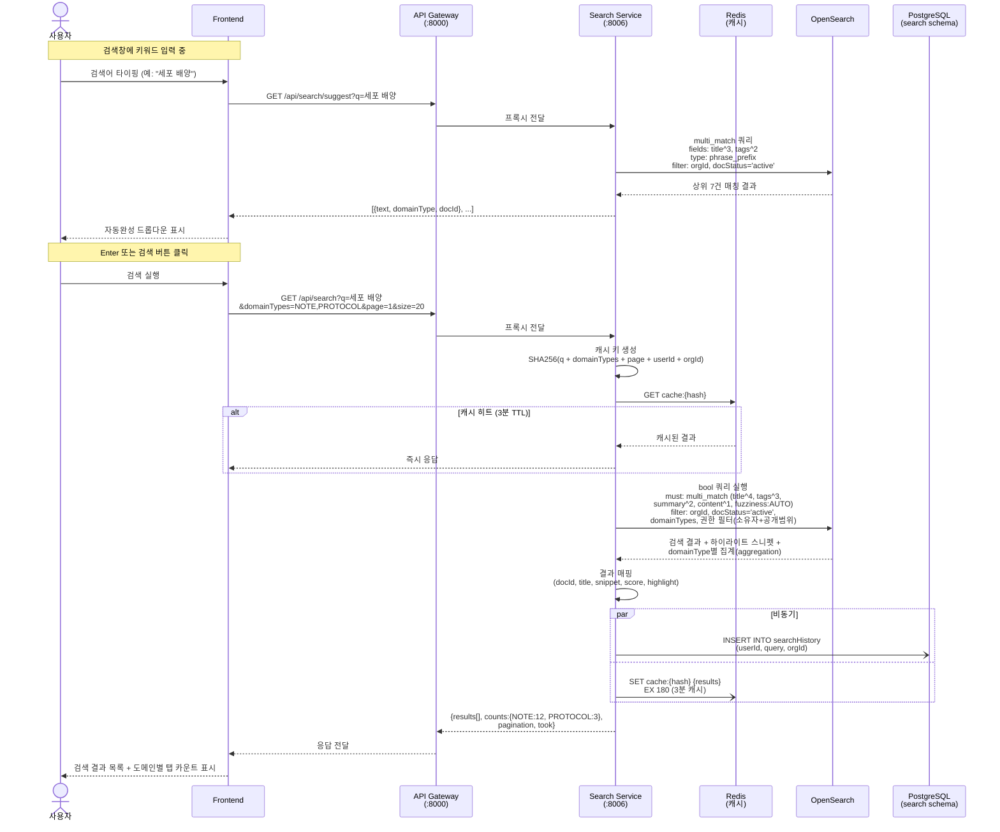

---

## 8. 인벤토리 수량 변경 및 재고 경고

### 8-1. 수량 입출고

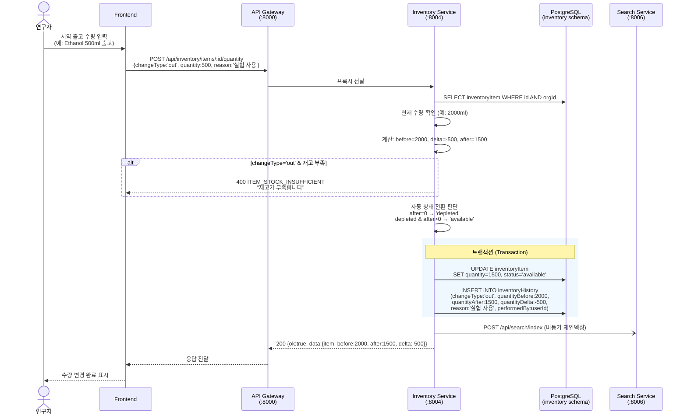

### 8-2. 재고 경고 (대시보드)

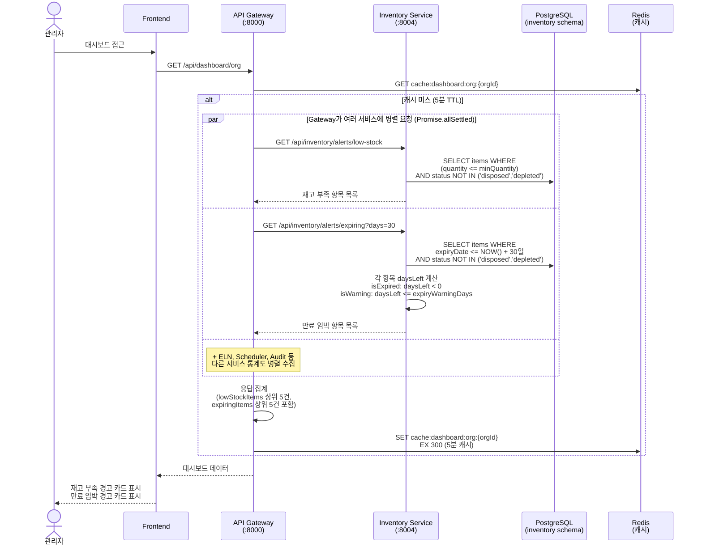

---

## 부록: 서비스 간 통신 요약

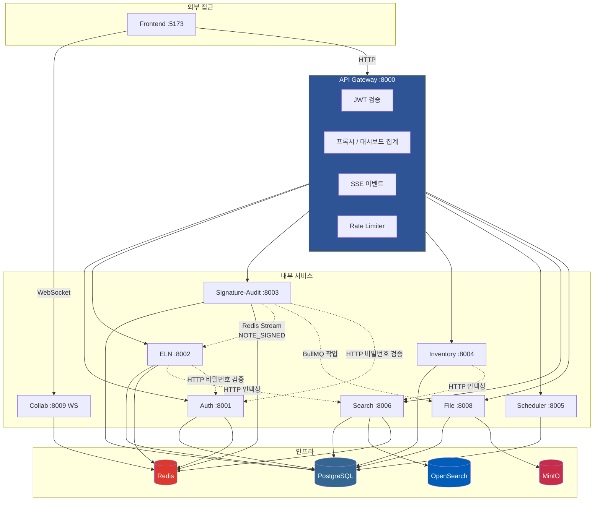

---

## 부록: 이벤트 흐름 매핑

| 이벤트 | 방식 | 발행자 | 구독자 | 트리거 |
|--------|------|--------|--------|--------|
| `NOTE_SIGNED` | Redis Stream (`labnote:events`) | Signature-Audit | ELN Service | 전자서명 완료 |
| `note.created/updated` | HTTP POST (내부) | ELN Service | Search Service | 노트 CRUD |
| `inventory.indexed` | HTTP POST (내부) | Inventory Service | Search Service | 인벤토리 CRUD |
| `export-status` | Redis Pub/Sub | Export Worker | API Gateway (SSE) | 내보내기 진행률 |
| `labnote:collab` | Redis Pub/Sub | Collab Service | Collab Service (다른 인스턴스) | 실시간 편집 |
| `NOTE_LOCKED/UNLOCKED` | HTTP POST (내부) | ELN Service | Signature-Audit (알림) | 상태 변경 |

---

> 이 문서는 실제 소스 코드 기반으로 작성되었습니다. 서비스 코드 변경 시 다이어그램도 함께 업데이트해주세요.
