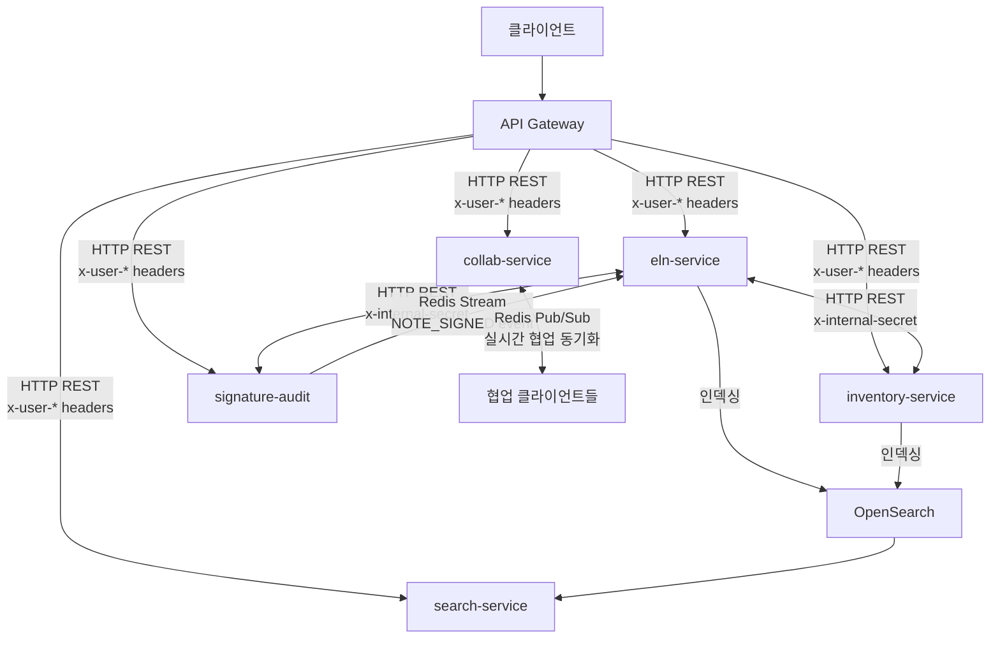
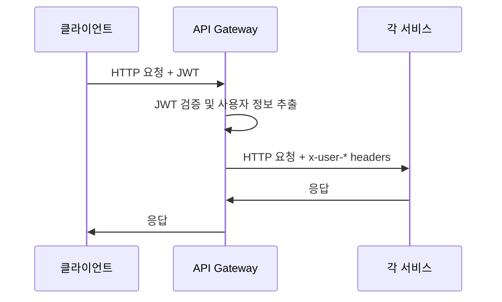
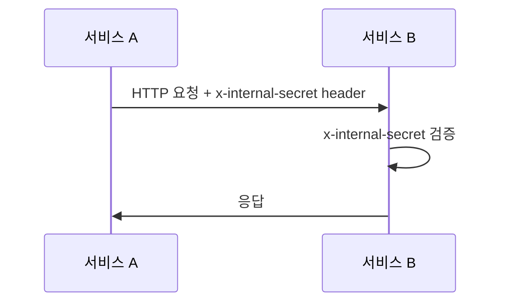
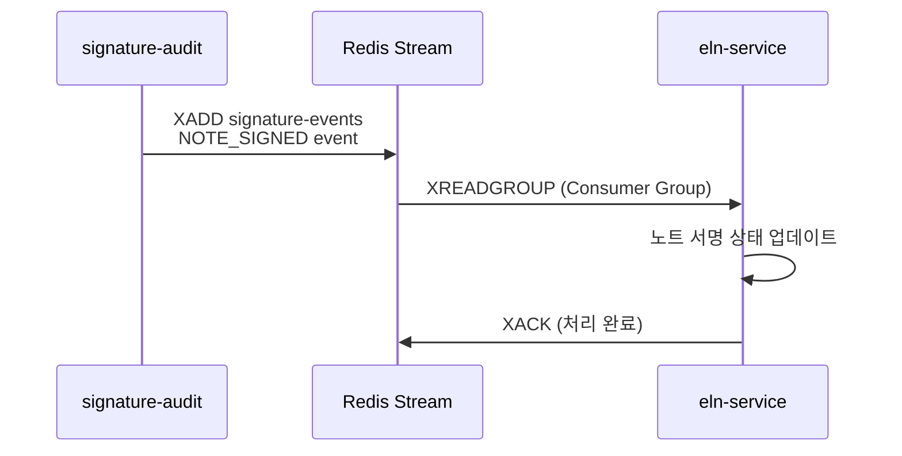
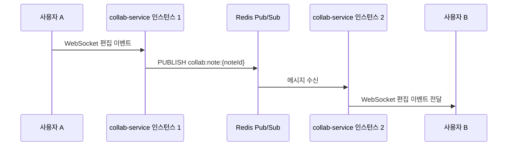
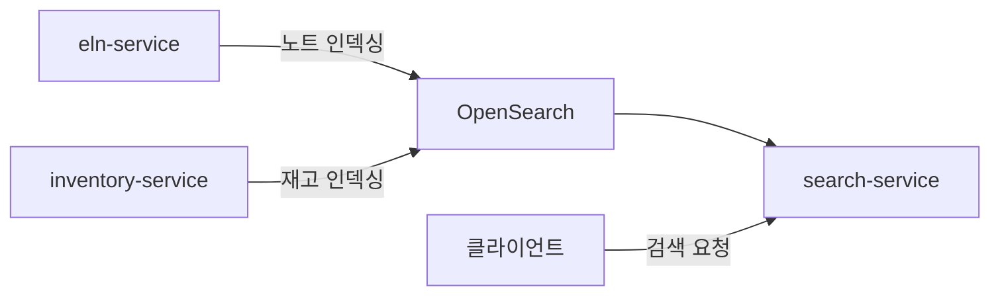

# 서비스 간 통신 구조

## 개요

ELN 시스템의 마이크로서비스 간 통신은 HTTP REST, Redis Stream, Redis Pub/Sub, OpenSearch 인덱싱 등 다양한 방식으로 이루어집니다. 모든 서비스 간 통신은 Docker 내부 DNS(`http://service-name:port`)를 통해 이루어집니다.

## 통신 방식 요약

| 통신 방식 | 용도 | 프로토콜 |
|-----------|------|----------|
| API Gateway → 각 서비스 | 클라이언트 요청 라우팅 | HTTP REST |
| 서비스 간 직접 통신 | 내부 API 호출 | HTTP REST |
| Redis Stream | 비동기 이벤트 전달 | Redis Stream |
| Redis Pub/Sub | 실시간 협업 동기화 | Redis Pub/Sub |
| OpenSearch | 검색 인덱싱 | HTTP REST |

## 전체 통신 다이어그램



## 1. API Gateway → 각 서비스 (HTTP REST)

API Gateway는 클라이언트의 요청을 인증/인가 후 각 서비스로 라우팅합니다.



### 전달되는 헤더

| 헤더 | 설명 |
|------|------|
| `x-user-id` | 사용자 고유 ID |
| `x-user-role` | 사용자 역할 (ADMIN, USER 등) |
| `x-user-name` | 사용자 이름 |

### 통신 주소 예시

```
http://eln-service:8080
http://inventory-service:8081
http://signature-audit:8082
http://collab-service:8083
http://search-service:8084
```

## 2. 서비스 간 직접 통신 (Internal API)

서비스 간 직접 호출 시 `x-internal-secret` 헤더를 통해 내부 통신임을 인증합니다.



### 보안

- `x-internal-secret` 값은 환경변수로 관리
- API Gateway에서 외부 요청의 `x-internal-secret` 헤더를 제거하여 위조 방지
- Docker 내부 네트워크에서만 접근 가능

## 3. Redis Stream: signature-audit → eln-service

전자서명 완료 시 `NOTE_SIGNED` 이벤트를 Redis Stream으로 발행하여 eln-service에서 처리합니다.



### 이벤트 구조

```json
{
  "eventType": "NOTE_SIGNED",
  "noteId": "note-uuid",
  "signedBy": "user-id",
  "signedAt": "2026-03-31T10:00:00Z"
}
```

### 특징

- Consumer Group을 사용하여 안정적인 메시지 처리
- 처리 실패 시 Pending 목록에서 재처리 가능
- 메시지 영속성 보장 (Stream은 메모리에 유지)

## 4. Redis Pub/Sub: collab-service (실시간 협업 동기화)

collab-service는 Redis Pub/Sub을 활용하여 여러 사용자 간 실시간 협업 편집을 동기화합니다.



### 채널 네이밍 규칙

- `collab:note:{noteId}` - 노트 편집 동기화
- `collab:cursor:{noteId}` - 커서 위치 동기화

### 주의사항

- Pub/Sub은 메시지 영속성이 없으므로 연결 끊김 시 데이터 유실 가능
- 재접속 시 최신 상태를 REST API로 조회하여 동기화

## 5. OpenSearch: 검색 인덱싱

eln-service와 inventory-service에서 데이터 변경 시 OpenSearch에 인덱싱하여 search-service에서 통합 검색을 제공합니다.



### 인덱스 구조

| 인덱스 | 소스 서비스 | 데이터 |
|--------|------------|--------|
| `notes` | eln-service | 실험 노트 |
| `inventory` | inventory-service | 재고/시약 정보 |

### 인덱싱 방식

- 데이터 생성/수정/삭제 시 비동기로 OpenSearch에 반영
- Bulk API를 활용한 배치 인덱싱 지원
- Docker 내부 DNS: `http://opensearch:9200`

## 통신 장애 대응

| 장애 유형 | 대응 방식 |
|-----------|-----------|
| 서비스 간 HTTP 호출 실패 | Spring Retry로 재시도 (최대 3회) |
| Redis Stream 처리 실패 | Pending 목록에서 자동 재처리 |
| Redis Pub/Sub 연결 끊김 | 재접속 후 REST API로 상태 동기화 |
| OpenSearch 인덱싱 실패 | 재시도 큐에 저장 후 재처리 |
