# LabNote ELN - 시퀀스 다이어그램

> 기능명세서 23개 기능에 대응하는 서비스 간 통신 흐름

---

## 인증/사용자

### #1 로그인 및 세션 관리

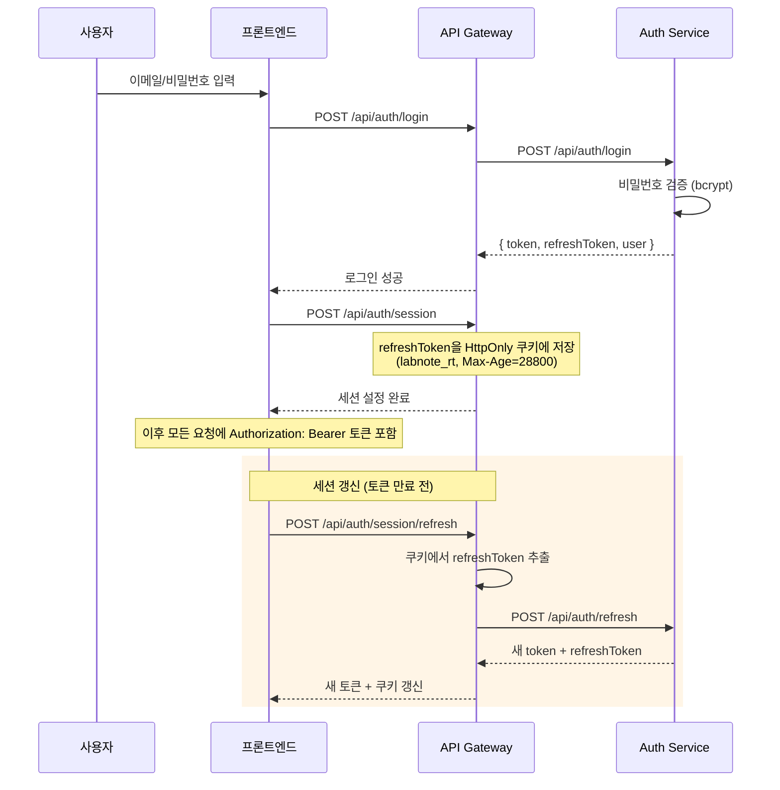
```mermaid
sequenceDiagram
    participant U as 사용자
    participant FE as 프론트엔드
    participant GW as API Gateway
    participant Auth as Auth Service

    U->>FE: 이메일/비밀번호 입력
    FE->>GW: POST /api/auth/login
    GW->>Auth: POST /api/auth/login
    Auth->>Auth: 비밀번호 검증 (bcrypt)
    Auth-->>GW: { token, refreshToken, user }
    GW-->>FE: 로그인 성공

    FE->>GW: POST /api/auth/session
    Note over GW: refreshToken을 HttpOnly 쿠키에 저장<br/>(labnote_rt, Max-Age=28800)
    GW-->>FE: 세션 설정 완료

    Note over FE: 이후 모든 요청에 Authorization: Bearer 토큰 포함

    rect rgb(255, 245, 230)
        Note over FE,GW: 세션 갱신 (토큰 만료 전)
        FE->>GW: POST /api/auth/session/refresh
        GW->>GW: 쿠키에서 refreshToken 추출
        GW->>Auth: POST /api/auth/refresh
        Auth-->>GW: 새 token + refreshToken
        GW-->>FE: 새 토큰 + 쿠키 갱신
    end
```

### #2 회원가입 (사용자 생성)

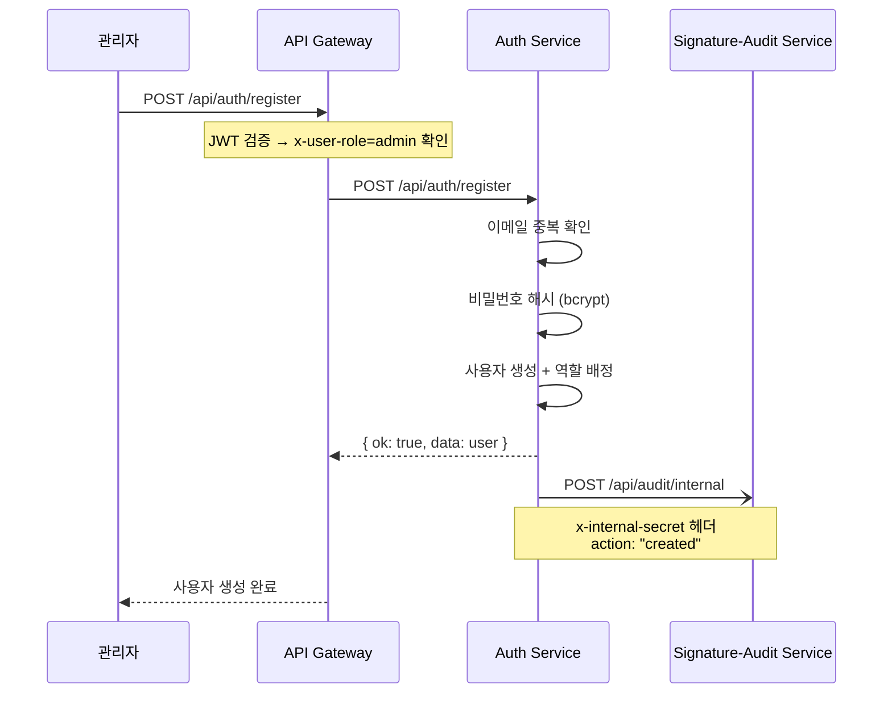
```mermaid
sequenceDiagram
    participant Admin as 관리자
    participant GW as API Gateway
    participant Auth as Auth Service
    participant Sig as Signature-Audit Service

    Admin->>GW: POST /api/auth/register
    Note over GW: JWT 검증 → x-user-role=admin 확인
    GW->>Auth: POST /api/auth/register
    Auth->>Auth: 이메일 중복 확인
    Auth->>Auth: 비밀번호 해시 (bcrypt)
    Auth->>Auth: 사용자 생성 + 역할 배정

    Auth-->>GW: { ok: true, data: user }

    Auth-)Sig: POST /api/audit/internal
    Note over Auth,Sig: x-internal-secret 헤더<br/>action: "created"

    GW-->>Admin: 사용자 생성 완료
```

### #3 사용자/팀/조직 관리

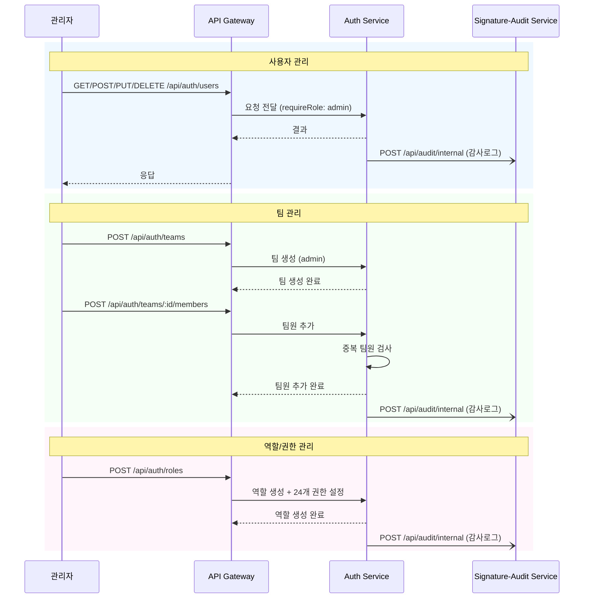
```mermaid
sequenceDiagram
    participant Admin as 관리자
    participant GW as API Gateway
    participant Auth as Auth Service
    participant Sig as Signature-Audit Service

    rect rgb(240, 248, 255)
        Note over Admin,Sig: 사용자 관리
        Admin->>GW: GET/POST/PUT/DELETE /api/auth/users
        GW->>Auth: 요청 전달 (requireRole: admin)
        Auth-->>GW: 결과
        Auth-)Sig: POST /api/audit/internal (감사로그)
        GW-->>Admin: 응답
    end

    rect rgb(245, 255, 245)
        Note over Admin,Sig: 팀 관리
        Admin->>GW: POST /api/auth/teams
        GW->>Auth: 팀 생성 (admin)
        Auth-->>GW: 팀 생성 완료
        Admin->>GW: POST /api/auth/teams/:id/members
        GW->>Auth: 팀원 추가
        Auth->>Auth: 중복 팀원 검사
        Auth-->>GW: 팀원 추가 완료
        Auth-)Sig: POST /api/audit/internal (감사로그)
    end

    rect rgb(255, 245, 250)
        Note over Admin,Sig: 역할/권한 관리
        Admin->>GW: POST /api/auth/roles
        GW->>Auth: 역할 생성 + 24개 권한 설정
        Auth-->>GW: 역할 생성 완료
        Auth-)Sig: POST /api/audit/internal (감사로그)
    end
```

---

## 연구노트

### #4 연구노트 작성 및 편집

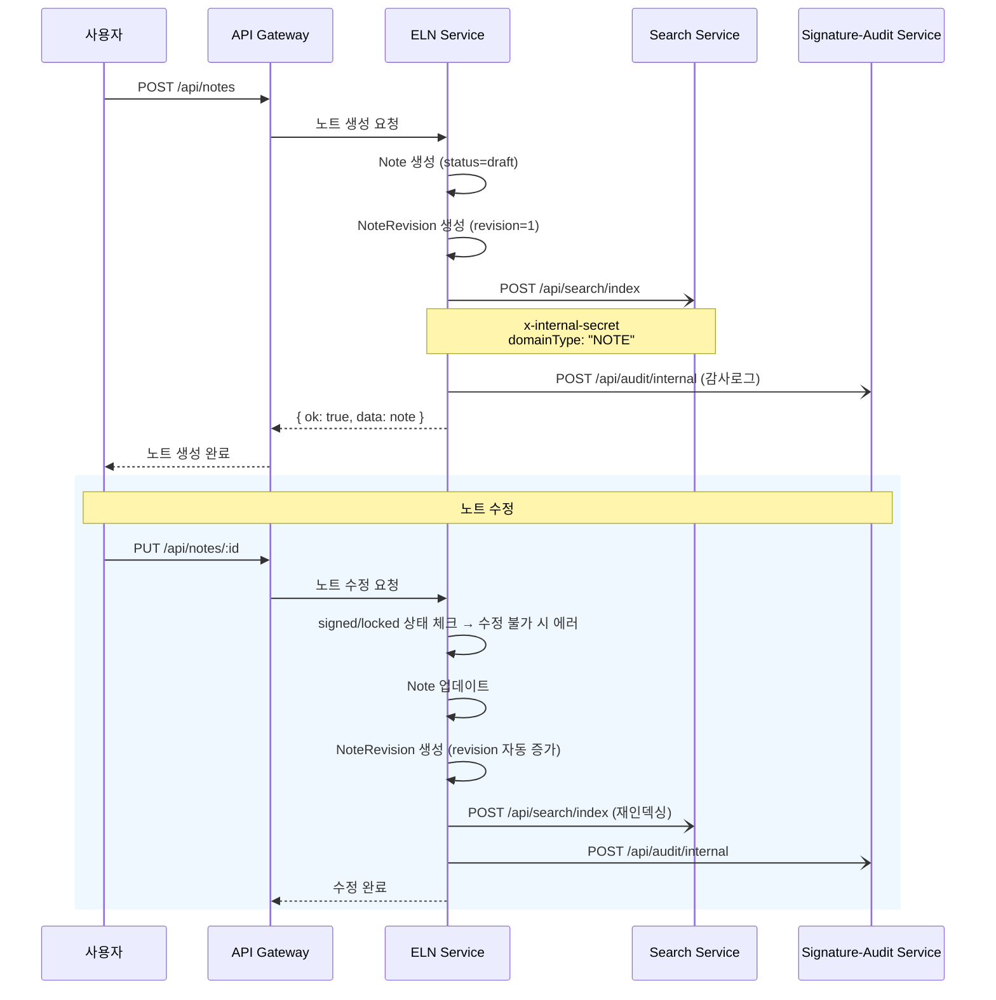
```mermaid
sequenceDiagram
    participant U as 사용자
    participant GW as API Gateway
    participant ELN as ELN Service
    participant Search as Search Service
    participant Sig as Signature-Audit Service

    U->>GW: POST /api/notes
    GW->>ELN: 노트 생성 요청
    ELN->>ELN: Note 생성 (status=draft)
    ELN->>ELN: NoteRevision 생성 (revision=1)
    ELN-)Search: POST /api/search/index
    Note over ELN,Search: x-internal-secret<br/>domainType: "NOTE"
    ELN-)Sig: POST /api/audit/internal (감사로그)
    ELN-->>GW: { ok: true, data: note }
    GW-->>U: 노트 생성 완료

    rect rgb(240, 248, 255)
        Note over U,Sig: 노트 수정
        U->>GW: PUT /api/notes/:id
        GW->>ELN: 노트 수정 요청
        ELN->>ELN: signed/locked 상태 체크 → 수정 불가 시 에러
        ELN->>ELN: Note 업데이트
        ELN->>ELN: NoteRevision 생성 (revision 자동 증가)
        ELN-)Search: POST /api/search/index (재인덱싱)
        ELN-)Sig: POST /api/audit/internal
        ELN-->>GW: 수정 완료
    end
```

### #5 실시간 협업 편집

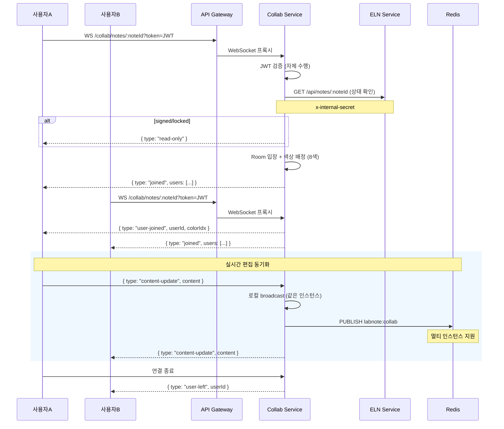
```mermaid
sequenceDiagram
    participant U1 as 사용자A
    participant U2 as 사용자B
    participant GW as API Gateway
    participant Collab as Collab Service
    participant ELN as ELN Service
    participant Redis as Redis

    U1->>GW: WS /collab/notes/:noteId?token=JWT
    GW->>Collab: WebSocket 프록시
    Collab->>Collab: JWT 검증 (자체 수행)
    Collab->>ELN: GET /api/notes/:noteId (상태 확인)
    Note over Collab,ELN: x-internal-secret
    alt signed/locked
        Collab-->>U1: { type: "read-only" }
    end
    Collab->>Collab: Room 입장 + 색상 배정 (8색)
    Collab-->>U1: { type: "joined", users: [...] }

    U2->>GW: WS /collab/notes/:noteId?token=JWT
    GW->>Collab: WebSocket 프록시
    Collab-->>U1: { type: "user-joined", userId, colorIdx }
    Collab-->>U2: { type: "joined", users: [...] }

    rect rgb(240, 248, 255)
        Note over U1,Redis: 실시간 편집 동기화
        U1->>Collab: { type: "content-update", content }
        Collab->>Collab: 로컬 broadcast (같은 인스턴스)
        Collab->>Redis: PUBLISH labnote:collab
        Note over Redis: 멀티 인스턴스 지원
        Collab-->>U2: { type: "content-update", content }
    end

    U1->>Collab: 연결 종료
    Collab-->>U2: { type: "user-left", userId }
```

### #6 연구노트 상태 전환

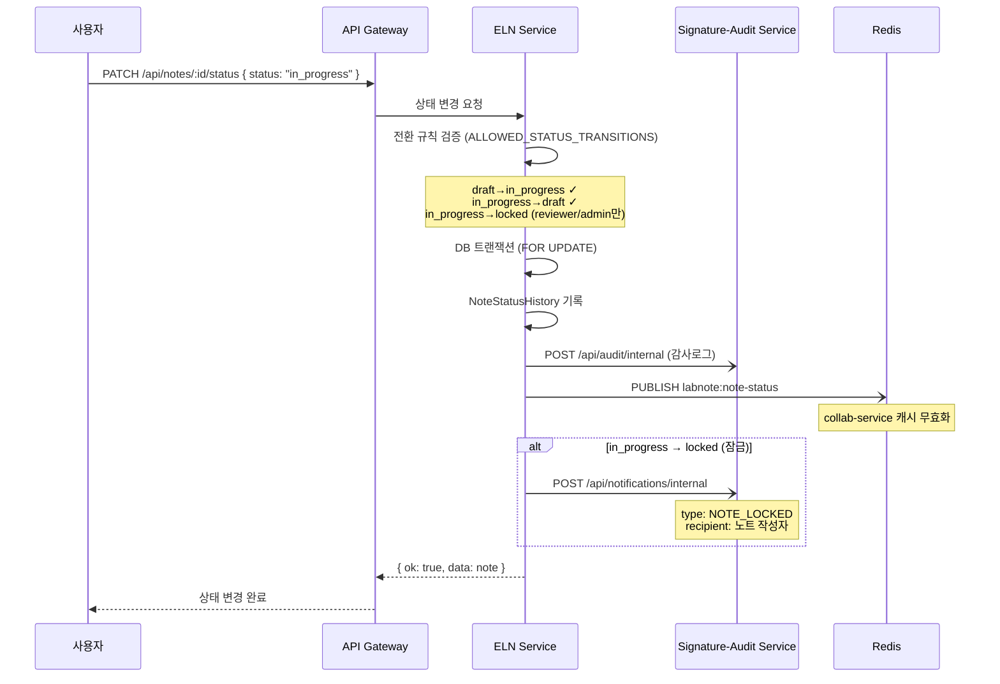
```mermaid
sequenceDiagram
    participant U as 사용자
    participant GW as API Gateway
    participant ELN as ELN Service
    participant Sig as Signature-Audit Service
    participant Redis as Redis

    U->>GW: PATCH /api/notes/:id/status { status: "in_progress" }
    GW->>ELN: 상태 변경 요청
    ELN->>ELN: 전환 규칙 검증 (ALLOWED_STATUS_TRANSITIONS)
    Note over ELN: draft→in_progress ✓<br/>in_progress→draft ✓<br/>in_progress→locked (reviewer/admin만)
    ELN->>ELN: DB 트랜잭션 (FOR UPDATE)
    ELN->>ELN: NoteStatusHistory 기록

    ELN-)Sig: POST /api/audit/internal (감사로그)
    ELN-)Redis: PUBLISH labnote:note-status
    Note over Redis: collab-service 캐시 무효화

    alt in_progress → locked (잠금)
        ELN-)Sig: POST /api/notifications/internal
        Note over Sig: type: NOTE_LOCKED<br/>recipient: 노트 작성자
    end

    ELN-->>GW: { ok: true, data: note }
    GW-->>U: 상태 변경 완료
```

### #7 연구노트 최종 전자서명

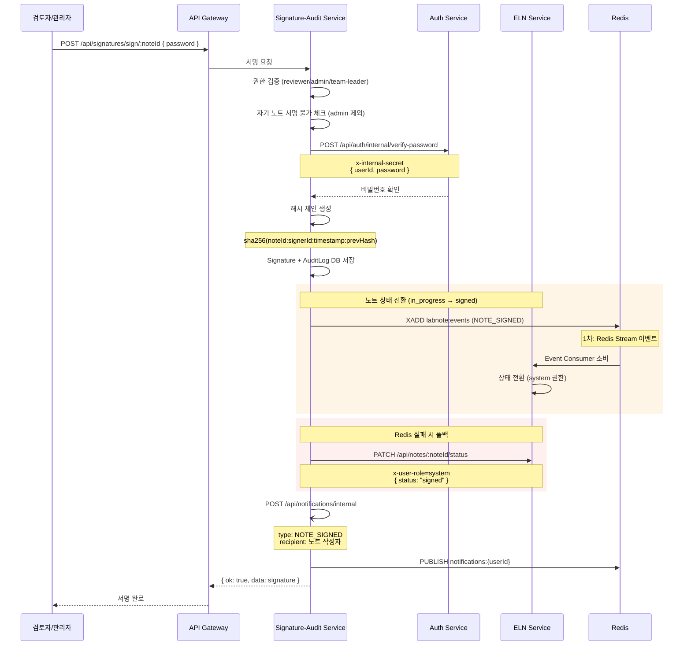
```mermaid
sequenceDiagram
    participant U as 검토자/관리자
    participant GW as API Gateway
    participant Sig as Signature-Audit Service
    participant Auth as Auth Service
    participant ELN as ELN Service
    participant Redis as Redis

    U->>GW: POST /api/signatures/sign/:noteId { password }
    GW->>Sig: 서명 요청

    Sig->>Sig: 권한 검증 (reviewer/admin/team-leader)
    Sig->>Sig: 자기 노트 서명 불가 체크 (admin 제외)

    Sig->>Auth: POST /api/auth/internal/verify-password
    Note over Sig,Auth: x-internal-secret<br/>{ userId, password }
    Auth-->>Sig: 비밀번호 확인

    Sig->>Sig: 해시 체인 생성
    Note over Sig: sha256(noteId:signerId:timestamp:prevHash)
    Sig->>Sig: Signature + AuditLog DB 저장

    rect rgb(255, 245, 230)
        Note over Sig,ELN: 노트 상태 전환 (in_progress → signed)
        Sig->>Redis: XADD labnote:events (NOTE_SIGNED)
        Note over Redis: 1차: Redis Stream 이벤트
        Redis->>ELN: Event Consumer 소비
        ELN->>ELN: 상태 전환 (system 권한)
    end

    rect rgb(255, 240, 240)
        Note over Sig,ELN: Redis 실패 시 폴백
        Sig->>ELN: PATCH /api/notes/:noteId/status
        Note over Sig,ELN: x-user-role=system<br/>{ status: "signed" }
    end

    Sig-)Sig: POST /api/notifications/internal
    Note over Sig: type: NOTE_SIGNED<br/>recipient: 노트 작성자
    Sig->>Redis: PUBLISH notifications:{userId}

    Sig-->>GW: { ok: true, data: signature }
    GW-->>U: 서명 완료
```

### #8 관리자 잠금 해제

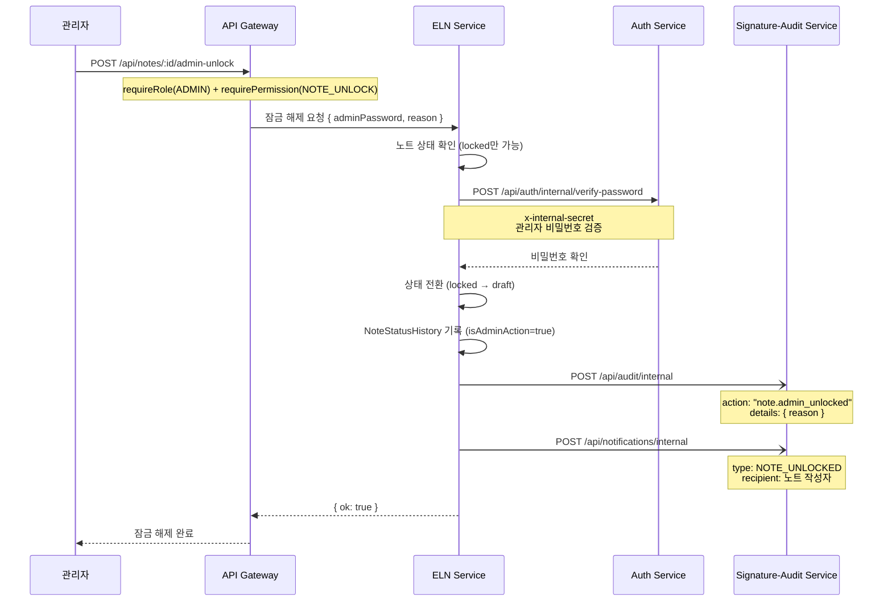
```mermaid
sequenceDiagram
    participant Admin as 관리자
    participant GW as API Gateway
    participant ELN as ELN Service
    participant Auth as Auth Service
    participant Sig as Signature-Audit Service

    Admin->>GW: POST /api/notes/:id/admin-unlock
    Note over GW: requireRole(ADMIN) + requirePermission(NOTE_UNLOCK)
    GW->>ELN: 잠금 해제 요청 { adminPassword, reason }

    ELN->>ELN: 노트 상태 확인 (locked만 가능)

    ELN->>Auth: POST /api/auth/internal/verify-password
    Note over ELN,Auth: x-internal-secret<br/>관리자 비밀번호 검증
    Auth-->>ELN: 비밀번호 확인

    ELN->>ELN: 상태 전환 (locked → draft)
    ELN->>ELN: NoteStatusHistory 기록 (isAdminAction=true)

    ELN-)Sig: POST /api/audit/internal
    Note over Sig: action: "note.admin_unlocked"<br/>details: { reason }

    ELN-)Sig: POST /api/notifications/internal
    Note over Sig: type: NOTE_UNLOCKED<br/>recipient: 노트 작성자

    ELN-->>GW: { ok: true }
    GW-->>Admin: 잠금 해제 완료
```

---

## 템플릿

### #9 템플릿 관리

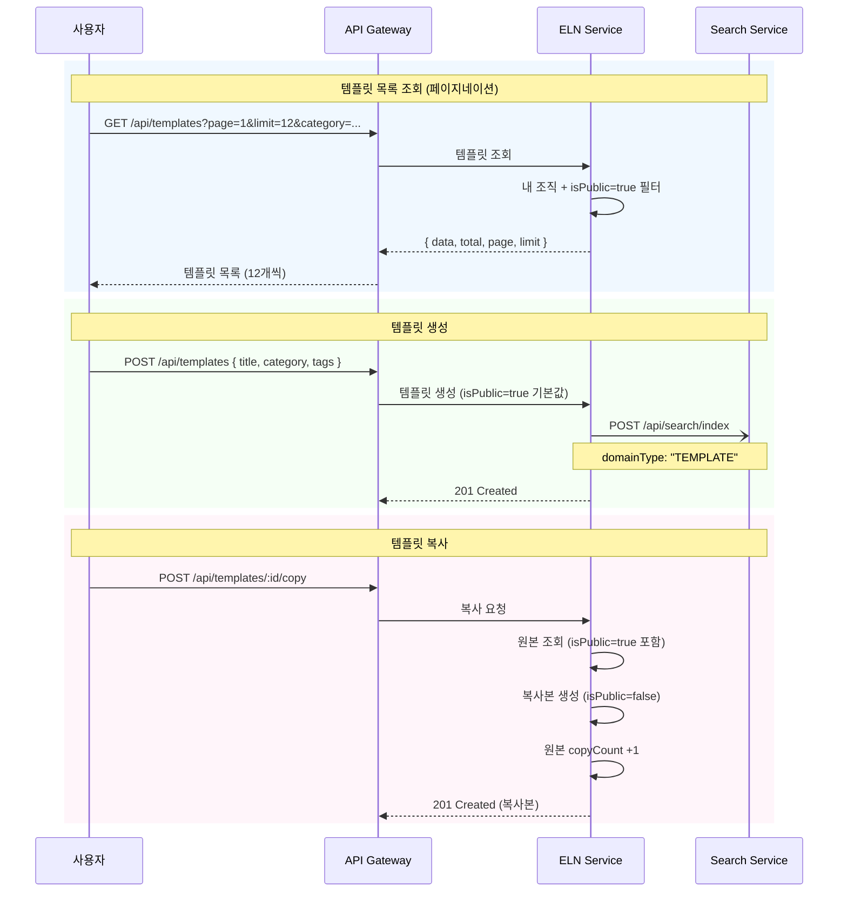
```mermaid
sequenceDiagram
    participant U as 사용자
    participant GW as API Gateway
    participant ELN as ELN Service
    participant Search as Search Service

    rect rgb(240, 248, 255)
        Note over U,Search: 템플릿 목록 조회 (페이지네이션)
        U->>GW: GET /api/templates?page=1&limit=12&category=...
        GW->>ELN: 템플릿 조회
        ELN->>ELN: 내 조직 + isPublic=true 필터
        ELN-->>GW: { data, total, page, limit }
        GW-->>U: 템플릿 목록 (12개씩)
    end

    rect rgb(245, 255, 245)
        Note over U,Search: 템플릿 생성
        U->>GW: POST /api/templates { title, category, tags }
        GW->>ELN: 템플릿 생성 (isPublic=true 기본값)
        ELN-)Search: POST /api/search/index
        Note over ELN,Search: domainType: "TEMPLATE"
        ELN-->>GW: 201 Created
    end

    rect rgb(255, 245, 250)
        Note over U,Search: 템플릿 복사
        U->>GW: POST /api/templates/:id/copy
        GW->>ELN: 복사 요청
        ELN->>ELN: 원본 조회 (isPublic=true 포함)
        ELN->>ELN: 복사본 생성 (isPublic=false)
        ELN->>ELN: 원본 copyCount +1
        ELN-->>GW: 201 Created (복사본)
    end
```

### #10 템플릿 기반 노트 생성

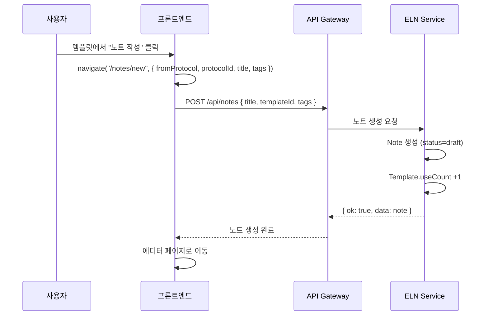
```mermaid
sequenceDiagram
    participant U as 사용자
    participant FE as 프론트엔드
    participant GW as API Gateway
    participant ELN as ELN Service

    U->>FE: 템플릿에서 "노트 작성" 클릭
    FE->>FE: navigate("/notes/new", { fromProtocol, protocolId, title, tags })
    FE->>GW: POST /api/notes { title, templateId, tags }
    GW->>ELN: 노트 생성 요청
    ELN->>ELN: Note 생성 (status=draft)
    ELN->>ELN: Template.useCount +1
    ELN-->>GW: { ok: true, data: note }
    GW-->>FE: 노트 생성 완료
    FE->>FE: 에디터 페이지로 이동
```

---

## 파일/내보내기

### #11 파일 업로드 및 다운로드

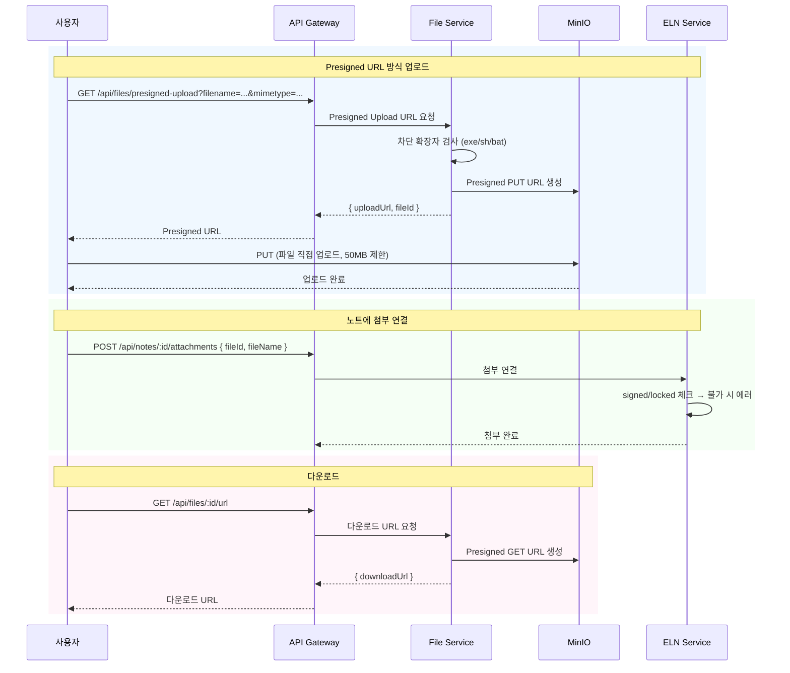
```mermaid
sequenceDiagram
    participant U as 사용자
    participant GW as API Gateway
    participant File as File Service
    participant MinIO as MinIO
    participant ELN as ELN Service

    rect rgb(240, 248, 255)
        Note over U,ELN: Presigned URL 방식 업로드
        U->>GW: GET /api/files/presigned-upload?filename=...&mimetype=...
        GW->>File: Presigned Upload URL 요청
        File->>File: 차단 확장자 검사 (exe/sh/bat)
        File->>MinIO: Presigned PUT URL 생성
        File-->>GW: { uploadUrl, fileId }
        GW-->>U: Presigned URL

        U->>MinIO: PUT (파일 직접 업로드, 50MB 제한)
        MinIO-->>U: 업로드 완료
    end

    rect rgb(245, 255, 245)
        Note over U,ELN: 노트에 첨부 연결
        U->>GW: POST /api/notes/:id/attachments { fileId, fileName }
        GW->>ELN: 첨부 연결
        ELN->>ELN: signed/locked 체크 → 불가 시 에러
        ELN-->>GW: 첨부 완료
    end

    rect rgb(255, 245, 250)
        Note over U,MinIO: 다운로드
        U->>GW: GET /api/files/:id/url
        GW->>File: 다운로드 URL 요청
        File->>MinIO: Presigned GET URL 생성
        File-->>GW: { downloadUrl }
        GW-->>U: 다운로드 URL
    end
```

### #12 PDF/ZIP 내보내기

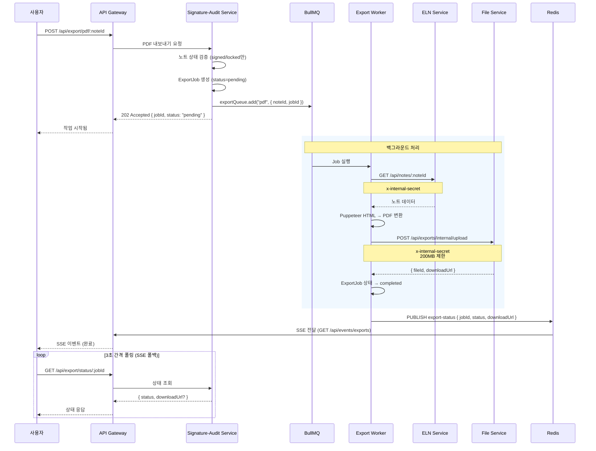
```mermaid
sequenceDiagram
    participant U as 사용자
    participant GW as API Gateway
    participant Sig as Signature-Audit Service
    participant Queue as BullMQ
    participant Worker as Export Worker
    participant ELN as ELN Service
    participant File as File Service
    participant Redis as Redis

    U->>GW: POST /api/export/pdf/:noteId
    GW->>Sig: PDF 내보내기 요청
    Sig->>Sig: 노트 상태 검증 (signed/locked만)
    Sig->>Sig: ExportJob 생성 (status=pending)
    Sig->>Queue: exportQueue.add("pdf", { noteId, jobId })
    Sig-->>GW: 202 Accepted { jobId, status: "pending" }
    GW-->>U: 작업 시작됨

    rect rgb(240, 248, 255)
        Note over Queue,File: 백그라운드 처리
        Queue->>Worker: Job 실행
        Worker->>ELN: GET /api/notes/:noteId
        Note over Worker,ELN: x-internal-secret
        ELN-->>Worker: 노트 데이터
        Worker->>Worker: Puppeteer HTML → PDF 변환
        Worker->>File: POST /api/exports/internal/upload
        Note over Worker,File: x-internal-secret<br/>200MB 제한
        File-->>Worker: { fileId, downloadUrl }
        Worker->>Worker: ExportJob 상태 → completed
    end

    Worker->>Redis: PUBLISH export-status { jobId, status, downloadUrl }
    Redis->>GW: SSE 전달 (GET /api/events/exports)
    GW-->>U: SSE 이벤트 (완료)

    loop 3초 간격 폴링 (SSE 폴백)
        U->>GW: GET /api/export/status/:jobId
        GW->>Sig: 상태 조회
        Sig-->>GW: { status, downloadUrl? }
        GW-->>U: 상태 응답
    end
```

### #13 노트-인벤토리 연결 관리

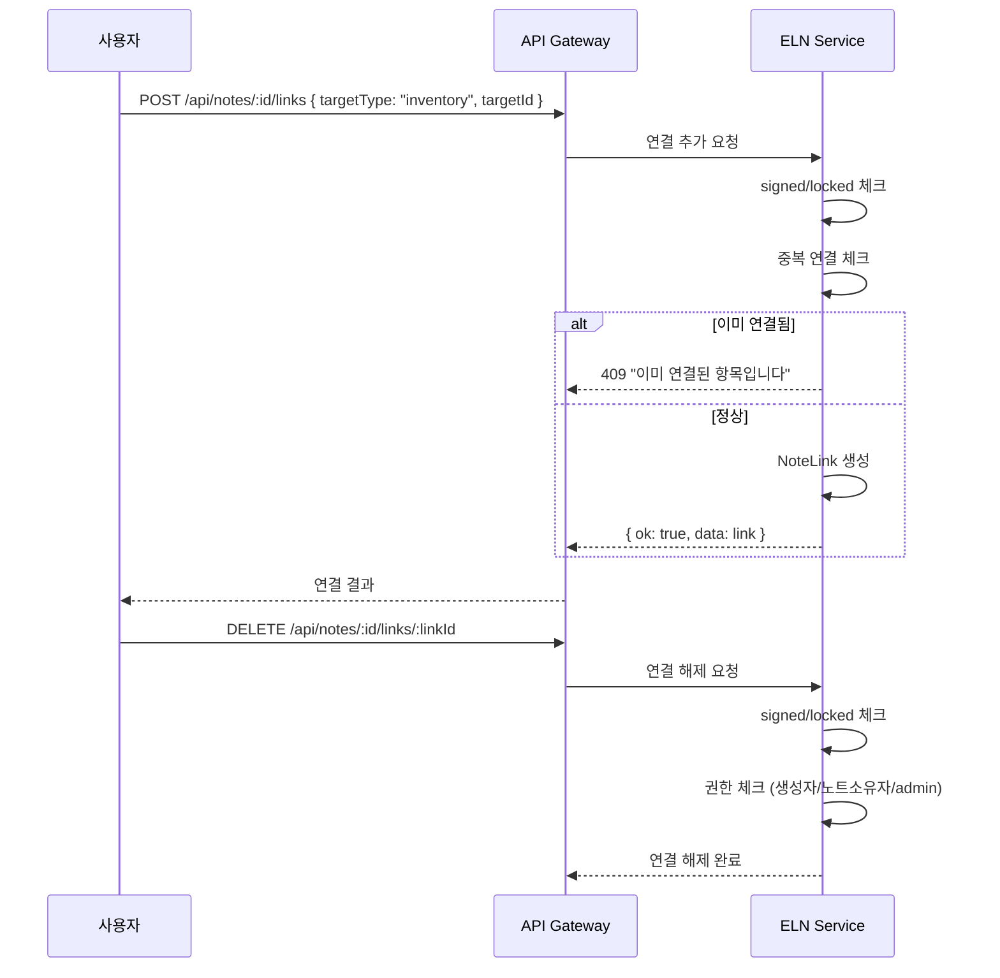
```mermaid
sequenceDiagram
    participant U as 사용자
    participant GW as API Gateway
    participant ELN as ELN Service

    U->>GW: POST /api/notes/:id/links { targetType: "inventory", targetId }
    GW->>ELN: 연결 추가 요청
    ELN->>ELN: signed/locked 체크
    ELN->>ELN: 중복 연결 체크
    alt 이미 연결됨
        ELN-->>GW: 409 "이미 연결된 항목입니다"
    else 정상
        ELN->>ELN: NoteLink 생성
        ELN-->>GW: { ok: true, data: link }
    end
    GW-->>U: 연결 결과

    U->>GW: DELETE /api/notes/:id/links/:linkId
    GW->>ELN: 연결 해제 요청
    ELN->>ELN: signed/locked 체크
    ELN->>ELN: 권한 체크 (생성자/노트소유자/admin)
    ELN-->>GW: 연결 해제 완료
```

---

## 인벤토리

### #14 인벤토리 항목 관리

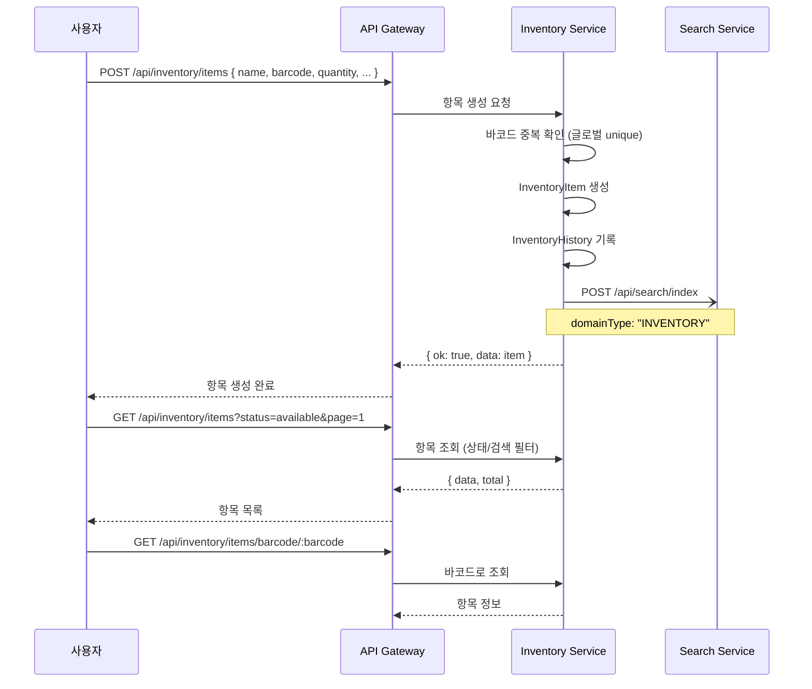
```mermaid
sequenceDiagram
    participant U as 사용자
    participant GW as API Gateway
    participant Inv as Inventory Service
    participant Search as Search Service

    U->>GW: POST /api/inventory/items { name, barcode, quantity, ... }
    GW->>Inv: 항목 생성 요청
    Inv->>Inv: 바코드 중복 확인 (글로벌 unique)
    Inv->>Inv: InventoryItem 생성
    Inv->>Inv: InventoryHistory 기록
    Inv-)Search: POST /api/search/index
    Note over Inv,Search: domainType: "INVENTORY"
    Inv-->>GW: { ok: true, data: item }
    GW-->>U: 항목 생성 완료

    U->>GW: GET /api/inventory/items?status=available&page=1
    GW->>Inv: 항목 조회 (상태/검색 필터)
    Inv-->>GW: { data, total }
    GW-->>U: 항목 목록

    U->>GW: GET /api/inventory/items/barcode/:barcode
    GW->>Inv: 바코드로 조회
    Inv-->>GW: 항목 정보
```

### #15 수량 입출고 및 이력

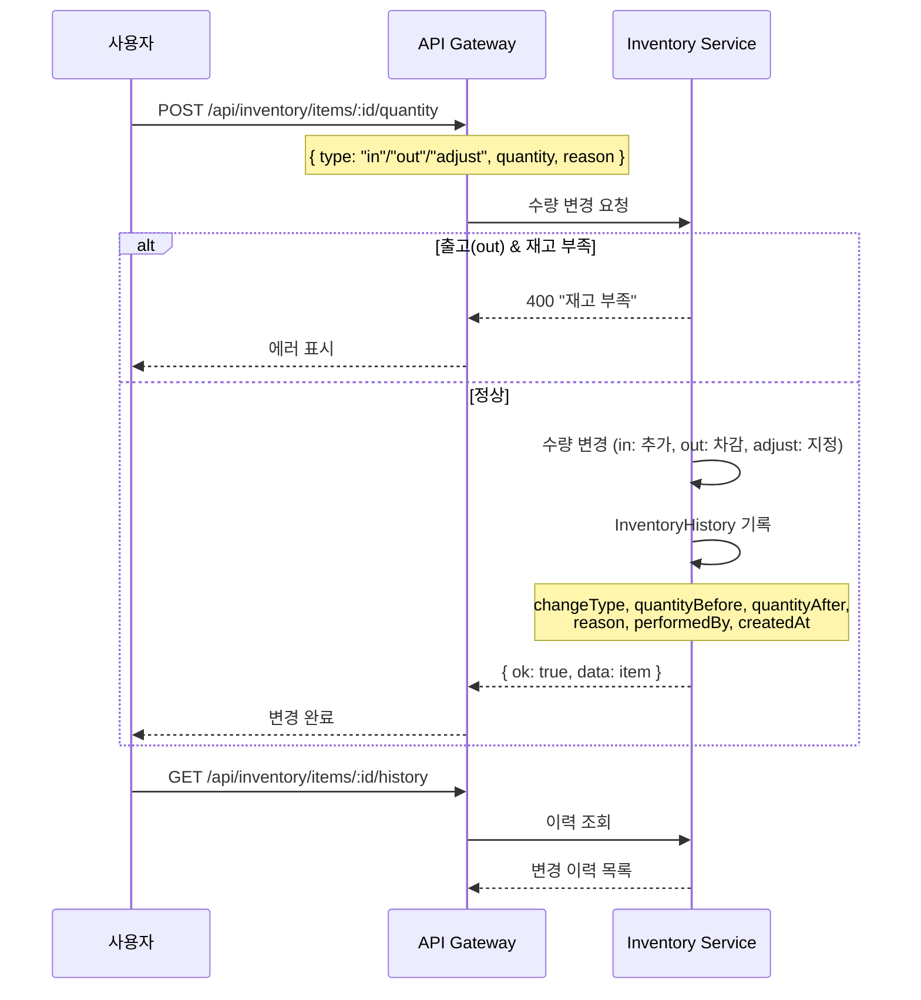
```mermaid
sequenceDiagram
    participant U as 사용자
    participant GW as API Gateway
    participant Inv as Inventory Service

    U->>GW: POST /api/inventory/items/:id/quantity
    Note over GW: { type: "in"/"out"/"adjust", quantity, reason }
    GW->>Inv: 수량 변경 요청

    alt 출고(out) & 재고 부족
        Inv-->>GW: 400 "재고 부족"
        GW-->>U: 에러 표시
    else 정상
        Inv->>Inv: 수량 변경 (in: 추가, out: 차감, adjust: 지정)
        Inv->>Inv: InventoryHistory 기록
        Note over Inv: changeType, quantityBefore, quantityAfter,<br/>reason, performedBy, createdAt
        Inv-->>GW: { ok: true, data: item }
        GW-->>U: 변경 완료
    end

    U->>GW: GET /api/inventory/items/:id/history
    GW->>Inv: 이력 조회
    Inv-->>GW: 변경 이력 목록
```

### #16 재고 경고 (부족/만료)

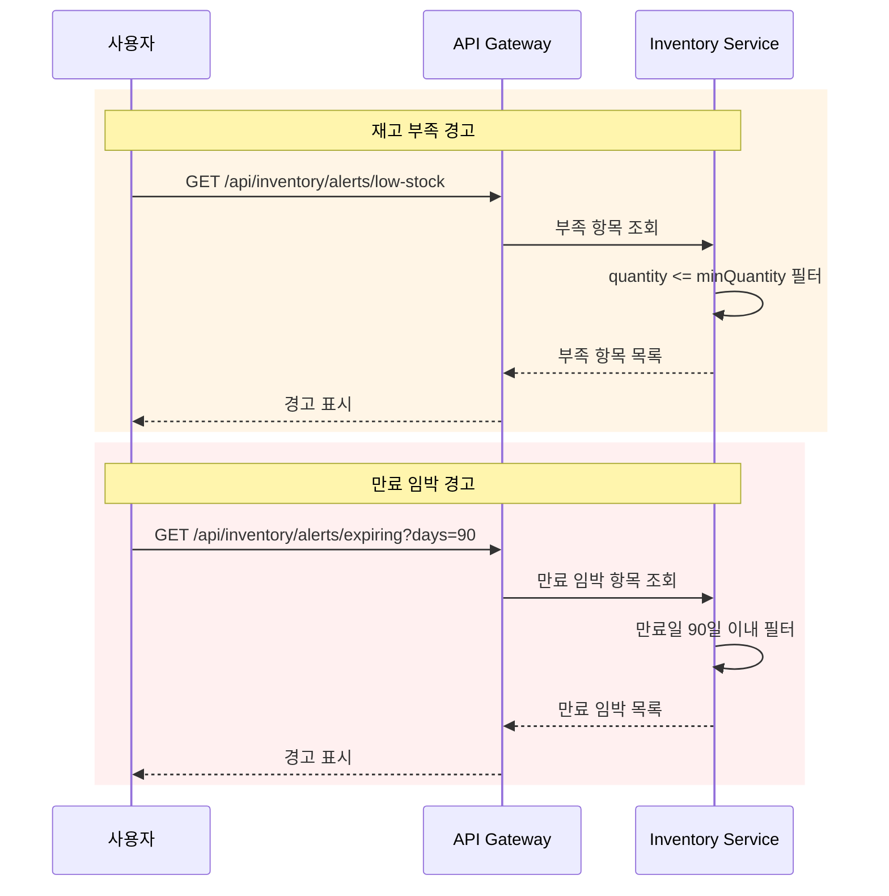
```mermaid
sequenceDiagram
    participant U as 사용자
    participant GW as API Gateway
    participant Inv as Inventory Service

    rect rgb(255, 245, 230)
        Note over U,Inv: 재고 부족 경고
        U->>GW: GET /api/inventory/alerts/low-stock
        GW->>Inv: 부족 항목 조회
        Inv->>Inv: quantity <= minQuantity 필터
        Inv-->>GW: 부족 항목 목록
        GW-->>U: 경고 표시
    end

    rect rgb(255, 240, 240)
        Note over U,Inv: 만료 임박 경고
        U->>GW: GET /api/inventory/alerts/expiring?days=90
        GW->>Inv: 만료 임박 항목 조회
        Inv->>Inv: 만료일 90일 이내 필터
        Inv-->>GW: 만료 임박 목록
        GW-->>U: 경고 표시
    end
```

---

## 스케줄러

### #17 장비/회의실 예약

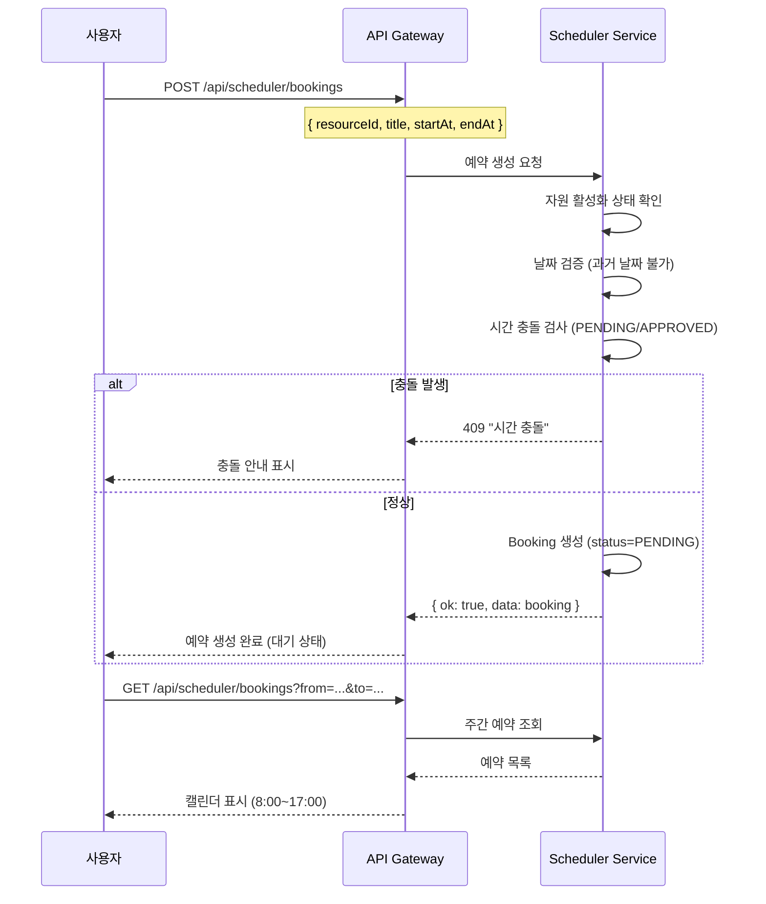
```mermaid
sequenceDiagram
    participant U as 사용자
    participant GW as API Gateway
    participant Sched as Scheduler Service

    U->>GW: POST /api/scheduler/bookings
    Note over GW: { resourceId, title, startAt, endAt }
    GW->>Sched: 예약 생성 요청
    Sched->>Sched: 자원 활성화 상태 확인
    Sched->>Sched: 날짜 검증 (과거 날짜 불가)
    Sched->>Sched: 시간 충돌 검사 (PENDING/APPROVED)
    alt 충돌 발생
        Sched-->>GW: 409 "시간 충돌"
        GW-->>U: 충돌 안내 표시
    else 정상
        Sched->>Sched: Booking 생성 (status=PENDING)
        Sched-->>GW: { ok: true, data: booking }
        GW-->>U: 예약 생성 완료 (대기 상태)
    end

    U->>GW: GET /api/scheduler/bookings?from=...&to=...
    GW->>Sched: 주간 예약 조회
    Sched-->>GW: 예약 목록
    GW-->>U: 캘린더 표시 (8:00~17:00)
```

### #18 예약 승인/반려/완료

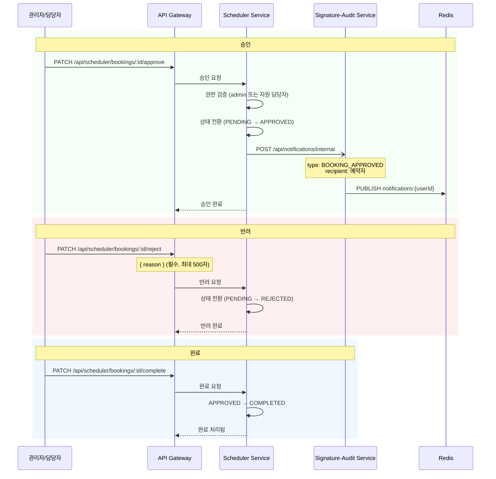
```mermaid
sequenceDiagram
    participant Admin as 관리자/담당자
    participant GW as API Gateway
    participant Sched as Scheduler Service
    participant Sig as Signature-Audit Service
    participant Redis as Redis

    rect rgb(245, 255, 245)
        Note over Admin,Redis: 승인
        Admin->>GW: PATCH /api/scheduler/bookings/:id/approve
        GW->>Sched: 승인 요청
        Sched->>Sched: 권한 검증 (admin 또는 자원 담당자)
        Sched->>Sched: 상태 전환 (PENDING → APPROVED)
        Sched-)Sig: POST /api/notifications/internal
        Note over Sig: type: BOOKING_APPROVED<br/>recipient: 예약자
        Sig->>Redis: PUBLISH notifications:{userId}
        Sched-->>GW: 승인 완료
    end

    rect rgb(255, 240, 240)
        Note over Admin,Redis: 반려
        Admin->>GW: PATCH /api/scheduler/bookings/:id/reject
        Note over GW: { reason } (필수, 최대 500자)
        GW->>Sched: 반려 요청
        Sched->>Sched: 상태 전환 (PENDING → REJECTED)
        Sched-->>GW: 반려 완료
    end

    rect rgb(240, 248, 255)
        Note over Admin,Sig: 완료
        Admin->>GW: PATCH /api/scheduler/bookings/:id/complete
        GW->>Sched: 완료 요청
        Sched->>Sched: APPROVED → COMPLETED
        Sched-->>GW: 완료 처리됨
    end
```

---

## 검색/대시보드

### #19 통합 검색

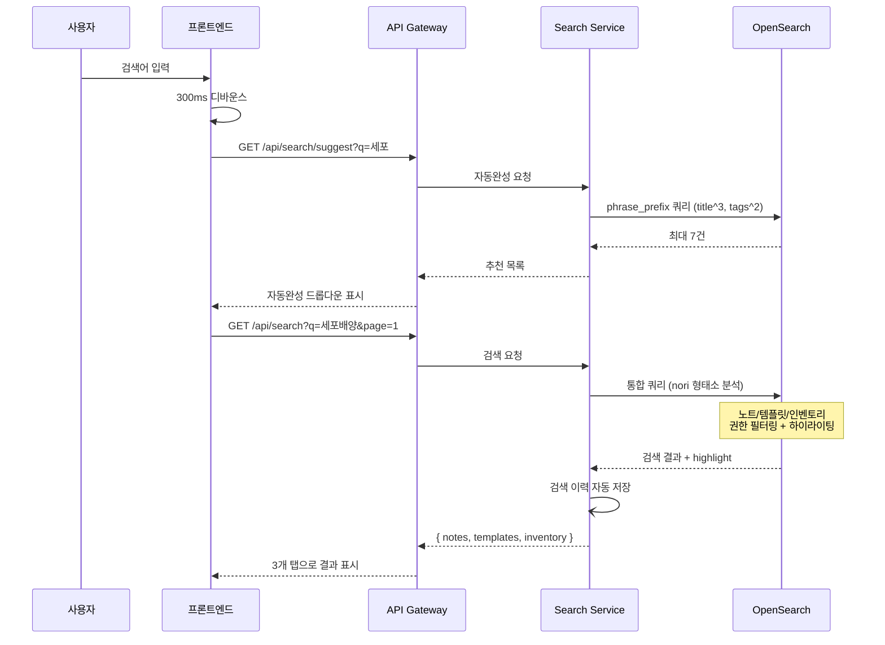
```mermaid
sequenceDiagram
    participant U as 사용자
    participant FE as 프론트엔드
    participant GW as API Gateway
    participant Search as Search Service
    participant OS as OpenSearch

    U->>FE: 검색어 입력
    FE->>FE: 300ms 디바운스

    FE->>GW: GET /api/search/suggest?q=세포
    GW->>Search: 자동완성 요청
    Search->>OS: phrase_prefix 쿼리 (title^3, tags^2)
    OS-->>Search: 최대 7건
    Search-->>GW: 추천 목록
    GW-->>FE: 자동완성 드롭다운 표시

    FE->>GW: GET /api/search?q=세포배양&page=1
    GW->>Search: 검색 요청
    Search->>OS: 통합 쿼리 (nori 형태소 분석)
    Note over OS: 노트/템플릿/인벤토리<br/>권한 필터링 + 하이라이팅
    OS-->>Search: 검색 결과 + highlight
    Search-)Search: 검색 이력 자동 저장
    Search-->>GW: { notes, templates, inventory }
    GW-->>FE: 3개 탭으로 결과 표시
```

### #20 검색 이력 및 즐겨찾기

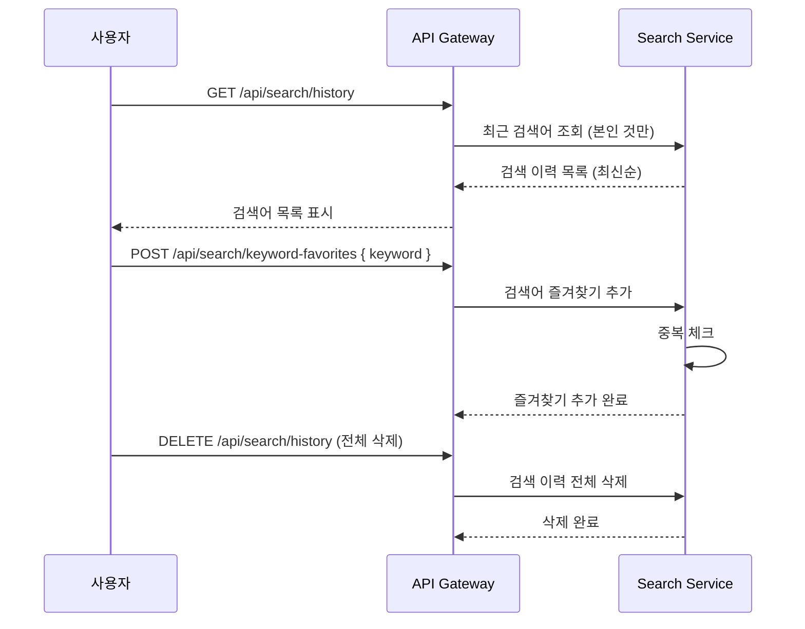
```mermaid
sequenceDiagram
    participant U as 사용자
    participant GW as API Gateway
    participant Search as Search Service

    U->>GW: GET /api/search/history
    GW->>Search: 최근 검색어 조회 (본인 것만)
    Search-->>GW: 검색 이력 목록 (최신순)
    GW-->>U: 검색어 목록 표시

    U->>GW: POST /api/search/keyword-favorites { keyword }
    GW->>Search: 검색어 즐겨찾기 추가
    Search->>Search: 중복 체크
    Search-->>GW: 즐겨찾기 추가 완료

    U->>GW: DELETE /api/search/history (전체 삭제)
    GW->>Search: 검색 이력 전체 삭제
    Search-->>GW: 삭제 완료
```

### #21 대시보드 통계

```mermaid
sequenceDiagram
    participant U as 사용자
    participant GW as API Gateway
    participant Redis as Redis
    participant ELN as ELN Service
    participant Inv as Inventory Service
    participant Sched as Scheduler Service
    participant Sig as Signature-Audit Service

    U->>GW: GET /api/dashboard/personal
    GW->>Redis: 캐시 조회 (TTL 120초)
    alt 캐시 있음
        Redis-->>GW: 캐시된 데이터
    else 캐시 없음
        par 병렬 호출
            GW->>ELN: GET /api/notes/stats (내 노트 통계)
            GW->>ELN: GET /api/notes?limit=4 (최근 노트)
            GW->>Sched: GET /api/scheduler/bookings?limit=4 (예정 예약)
            GW->>Sig: GET /api/notifications/unread-count (알림 수)
            GW->>Sig: GET /api/audit?limit=4 (최근 활동)
        end
        ELN-->>GW: 노트 통계/목록
        Sched-->>GW: 예약 목록
        Sig-->>GW: 알림 수/활동 목록
        GW->>Redis: 캐시 저장 (TTL 120초)
    end
    GW-->>U: 대시보드 데이터

    rect rgb(255, 245, 250)
        Note over U,Sig: 조직 대시보드 (관리자 전용)
        U->>GW: GET /api/dashboard/org
        GW->>GW: admin 권한 확인
        par 병렬 호출 (캐시 TTL 300초)
            GW->>ELN: 전사 노트 통계
            GW->>Inv: GET /api/inventory/alerts/low-stock
            GW->>Inv: GET /api/inventory/alerts/expiring
            GW->>Sig: 서명 준수 통계
        end
        GW-->>U: 조직 대시보드 데이터
    end
```

---

## 감사/알림

### #22 감사로그 조회

```mermaid
sequenceDiagram
    participant U as 사용자
    participant GW as API Gateway
    participant Sig as Signature-Audit Service

    U->>GW: GET /api/audit?actorId=...&action=...&dateFrom=...&dateTo=...&page=1
    Note over GW: requirePermission(audit:read)
    GW->>Sig: 감사로그 조회 (페이지당 20건)
    Sig-->>GW: { data: logs[], total }
    GW-->>U: 감사로그 테이블 표시

    Note over U,Sig: 감사로그는 수정/삭제 불가

    rect rgb(230, 230, 230)
        Note over GW,Sig: 내부 서비스에서 감사로그 자동 생성
        Note over Sig: POST /api/audit/internal<br/>x-internal-secret 헤더<br/><br/>호출원:<br/>- Auth Service (사용자/팀/역할 관리)<br/>- ELN Service (노트 CRUD/상태변경)<br/>- Signature-Audit (서명/취소)<br/>- Scheduler Service (예약)
    end
```

### #23 실시간 알림

```mermaid
sequenceDiagram
    participant Service as 내부 서비스
    participant Sig as Signature-Audit Service
    participant Redis as Redis
    participant GW as API Gateway
    participant FE as 프론트엔드

    rect rgb(240, 248, 255)
        Note over Service,FE: 알림 생성 → 실시간 전달
        Service->>Sig: POST /api/notifications/internal
        Note over Service,Sig: x-internal-secret<br/>type: NOTE_SIGNED/LOCKED/UNLOCKED/BOOKING_APPROVED
        Sig->>Sig: Notification DB 저장
        Sig->>Redis: SET notif-unread:{userId} (TTL 300초)
        Sig->>Redis: PUBLISH notifications:{userId}
    end

    rect rgb(245, 255, 245)
        Note over GW,FE: SSE 실시간 수신
        FE->>GW: GET /api/events/notifications
        GW->>Redis: SUBSCRIBE notifications:{userId}
        loop 실시간 이벤트
            Redis-->>GW: 알림 메시지
            GW-->>FE: SSE event: notification
        end
        loop 30초 간격
            GW-->>FE: SSE heartbeat
        end
    end

    rect rgb(255, 245, 250)
        Note over FE,Sig: 알림 읽음 처리
        FE->>GW: PATCH /api/notifications/:id/read
        GW->>Sig: 읽음 처리
        Sig->>Redis: DECR notif-unread:{userId}

        FE->>GW: PATCH /api/notifications/read-all
        GW->>Sig: 전체 읽음
        Sig->>Redis: DEL notif-unread:{userId}
    end
```
